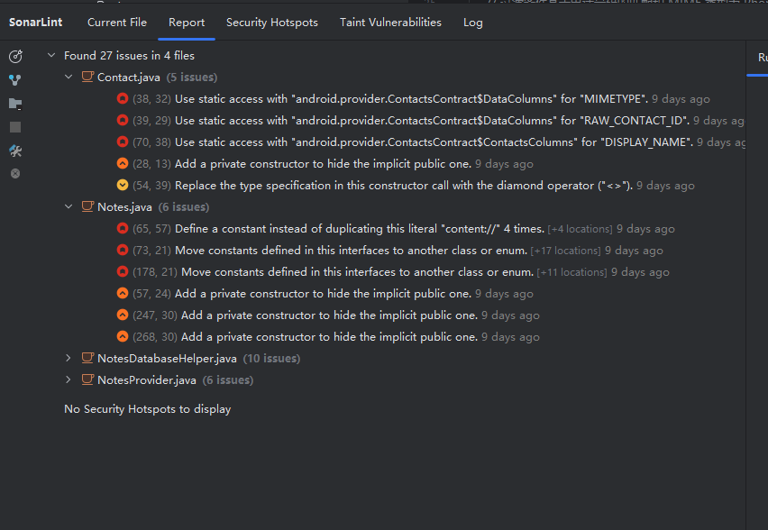
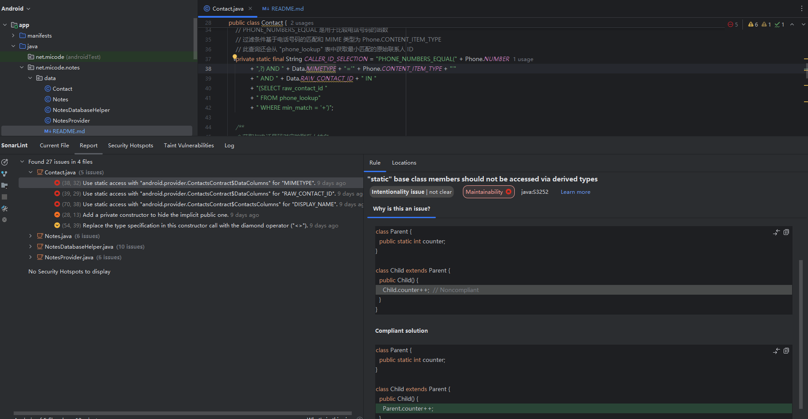
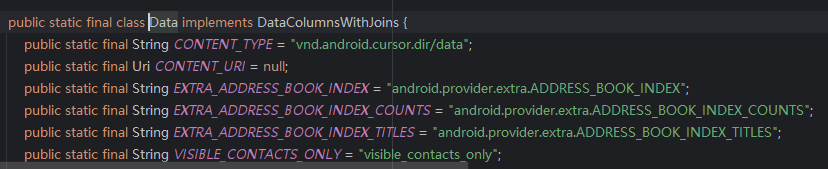
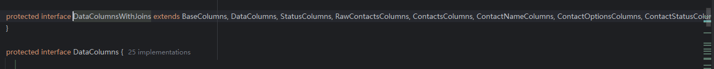
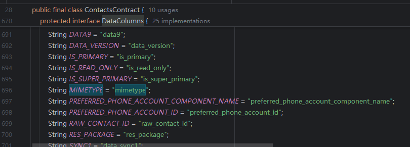
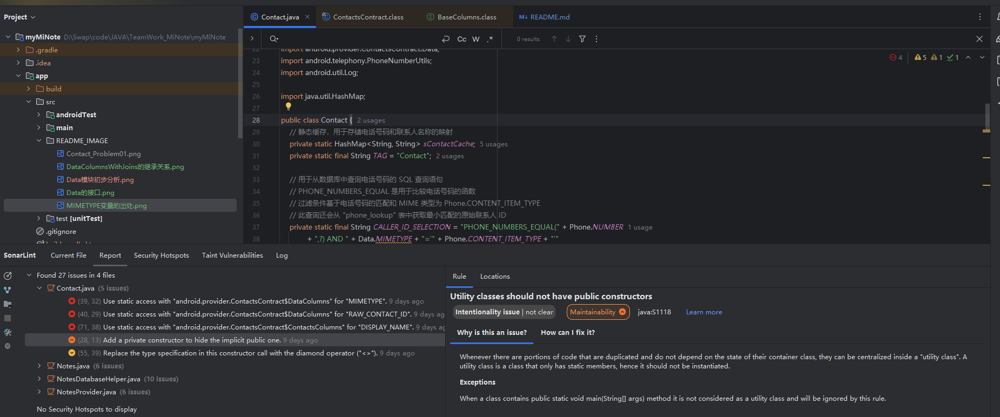
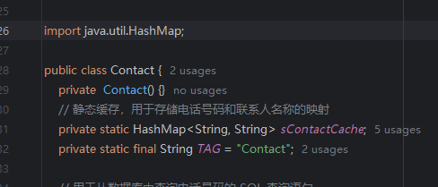

# data文件夹源码分析

在SonarQube中，代码缺陷分为以下五个级别：
- **Blocker**: 极有可能影响应用程序表现的错误;
- **Critical**: 可能影响应用程序表现的错误和表示安全缺陷的问题;
- **Major**:严重影响开发者效率的质量缺陷:.
- **Minor**:轻微影响开发者效率的质量缺陷;.
- **Info**:不是错误或者质量缺陷。
所以在下面代码质量检测模块中将主要分析缺陷等级为Blocker、Critical、Major的部分：

## Contact.java类源码分析
###  **类结构**:

- **类名**: `Contact`
- **包名**: `net.micode.notes.data`
- **依赖库**: 
  - Android SDK classes: 
    - `Context`: 用于访问内容提供者。
    - `Cursor`: 用于操作数据库查询的结果集。
    - `ContactsContract`: 访问联系人相关信息的内容提供者类。
    - `PhoneNumberUtils`: Android 的工具类，用于处理电话号码。
    - `Log`: Android 的日志工具类，用于记录调试信息。
  - Java SDK classes:
    - `HashMap`: 用于缓存电话号码和联系人姓名的映射。
- **成员变量**:
  - `sContactCache`: 静态缓存，`HashMap<String, String>` 类型，用于存储电话号码与联系人姓名的映射。
  - `TAG`: 静态常量，用于日志记录的标签。
  - `CALLER_ID_SELECTION`: 静态常量，SQL 查询字符串，用于根据电话号码查询联系人。

###  **对外提供的方法**:

- **`getContact(Context context, String phoneNumber)`**:
  - **参数**:
    - `context`: Android 上下文，用于访问内容提供者。
    - `phoneNumber`: 查询的电话号码。
  - **返回值**:
    - `String`: 返回与电话号码匹配的联系人姓名，如果未找到则返回 `null`。
  - **描述**:
    - 这是唯一对外公开的静态方法，用于查询给定电话号码的联系人姓名。该方法会首先检查是否有缓存的联系人信息，如果缓存没有匹配项，则执行数据库查询获取联系人姓名，并将其缓存起来，以便后续快速查询。

###  **实现的功能**:

- **缓存机制**: 
  - 使用 `HashMap` 对电话号码和联系人姓名进行缓存，减少对数据库的重复查询，提高查询效率。
  
- **SQL 查询语句**:
  - 通过 `CALLER_ID_SELECTION` 构建 SQL 查询字符串，用于查询 `ContactsContract.Data` 表，查找给定电话号码的联系人姓名。查询条件基于电话号码的匹配，并通过 `PhoneNumberUtils.toCallerIDMinMatch` 函数处理电话号码的最小匹配。
  
- **数据库查询**:
  - 使用 Android 的内容提供者 `context.getContentResolver().query` 查询 `Data.CONTENT_URI` 表，检索符合条件的联系人信息。
  
- **异常处理**:
  - 通过 `try-catch` 捕获查询数据时可能发生的 `IndexOutOfBoundsException` 异常，避免程序崩溃，并在日志中记录错误信息。

###  **使用SonarLint进行代码质量检测**:
先用**SonarLint**整体扫一遍，发现data模块中的四个文件中有27个问题。


但这其中有很多问题是因时代原因和重复的。所以需要人工复审一下。复审就很容易知道，其中一大半都是命名规范，或是因时代导致当时的函数如今被废弃了。

#### Contact.java



问题：**"static" base class members should not be accessed via derived types.(“静态”基类成员不应通过派生类型访问。)**

静态成员（方法或属性）是在类层级上定义的，而不是在具体的实例层级上。静态成员是共享的，无论该类有多少个实例，所有实例共享一个静态成员。
派生类继承了基类的行为和状态，但静态成员不会跟随类的继承链走。因此，当通过派生类访问基类的静态成员时，可能会造成逻辑混淆。它暗示着静态成员与派生类关联，但实际上静态成员与派生类无关。
静态成员属于基类，如果通过派生类来访问这些静态成员，开发者可能会误以为这些成员是派生类独有的，或者与派生类直接关联。这可能导致误解或难以维护的代码。
SonarLint中给出的例子如下：
``` java
class Parent {
  public static int counter;
}

class Child extends Parent {
  public Child() {
    Child.counter++;  // 不推荐
  }
}
```

``` java
class Parent {
  public static int counter;
}

class Child extends Parent {
  public Child() {
    Parent.counter++;   //应当改为这种形式，让父对象去访问static属性
  }
}
```

static变量无论在哪里使用，都是共享同一块内存空间。所以最好是使用定义了这个静态变量的类名进行属性的引用。

``` java
private static final String CALLER_ID_SELECTION = "PHONE_NUMBERS_EQUAL(" + Phone.NUMBER  
+ ",?) AND " + Data.MIMETYPE + "='" + Phone.CONTENT_ITEM_TYPE + "'"  
+ " AND " + Data.RAW_CONTACT_ID + " IN "  
        + "(SELECT raw_contact_id "  
        + " FROM phone_lookup"  
        + " WHERE min_match = '+')";
```

但是经过实际查看源码发现Data变量是实现了`DataColumnsWithJoins`接口，而接口中的成员变量是无法访问的。
MIMETYPE变量是DataColumnsWithJoins的父类



其余三个**Blocker**均为相同原因。



问题：**Utility classes should not have public constructors。(创建工具类或者常量类要创建私有化构造方法)**
我们在新建工具类或者新建某个常量Const类，要创建一个私有的构造方法。因为我们不创带参构造的情况下，Java类会默认生成一个无参构造方法，但是一般工具类或者常量类是不允许通过new来实例化对象的，都是通过声明一个个静态方法或者变量，通过类名+ (.)点+ 方法来调用，所以注意像下图案例一样，要创建一个私有化的构造方法，覆盖掉原有的无参构造，让该类无法创建实例

如图，增加无参私有构造函数后下划黄线消失，错误解决

#### Notes.java
> TODO
>

#### NotesDataBasesHelper.java
>TODO

#### NotesProvider.java
> TODO

[返回源码分析报告页面](../../../../../../../README.md)