# data文件夹源码分析

先用**SonarLint**整体扫一遍，发现data模块中的四个文件中有27个问题。


但这其中有很多问题是因时代原因和重复的。所以需要人工复审一下。复审就很容易知道，其中一大半都是命名规范，或是因时代导致当时的函数如今被废弃了。


在SonarQube中，代码缺陷分为以下五个级别：
- **Blocker**: 极有可能影响应用程序表现的错误;
- **Critical**: 可能影响应用程序表现的错误和表示安全缺陷的问题;
- **Major**:严重影响开发者效率的质量缺陷:.
- **Minor**:轻微影响开发者效率的质量缺陷;.
- **Info**:不是错误或者质量缺陷。
所以在下面代码质量检测模块中将主要分析缺陷等级为Blocker、Critical、Major的部分：

## Contact.java类源码分析
###  **类结构**:

- **类名**: `Contact`
- **包名**: `net.micode.notes.data`
- **依赖库**: 
  - Android SDK classes: 
    - `Context`: 用于访问内容提供者。
    - `Cursor`: 用于操作数据库查询的结果集。
    - `ContactsContract`: 访问联系人相关信息的内容提供者类。
    - `PhoneNumberUtils`: Android 的工具类，用于处理电话号码。
    - `Log`: Android 的日志工具类，用于记录调试信息。
  - Java SDK classes:
    - `HashMap`: 用于缓存电话号码和联系人姓名的映射。
- **成员变量**:
  - `sContactCache`: 静态缓存，`HashMap<String, String>` 类型，用于存储电话号码与联系人姓名的映射。
  - `TAG`: 静态常量，用于日志记录的标签。
  - `CALLER_ID_SELECTION`: 静态常量，SQL 查询字符串，用于根据电话号码查询联系人。

###  **对外提供的方法**:

- **`getContact(Context context, String phoneNumber)`**:
  - **参数**:
    - `context`: Android 上下文，用于访问内容提供者。
    - `phoneNumber`: 查询的电话号码。
  - **返回值**:
    - `String`: 返回与电话号码匹配的联系人姓名，如果未找到则返回 `null`。
  - **描述**:
    - 这是唯一对外公开的静态方法，用于查询给定电话号码的联系人姓名。该方法会首先检查是否有缓存的联系人信息，如果缓存没有匹配项，则执行数据库查询获取联系人姓名，并将其缓存起来，以便后续快速查询。

###  **实现的功能**:

- **缓存机制**: 
  - 使用 `HashMap` 对电话号码和联系人姓名进行缓存，减少对数据库的重复查询，提高查询效率。
  
- **SQL 查询语句**:
  - 通过 `CALLER_ID_SELECTION` 构建 SQL 查询字符串，用于查询 `ContactsContract.Data` 表，查找给定电话号码的联系人姓名。查询条件基于电话号码的匹配，并通过 `PhoneNumberUtils.toCallerIDMinMatch` 函数处理电话号码的最小匹配。
  
- **数据库查询**:
  - 使用 Android 的内容提供者 `context.getContentResolver().query` 查询 `Data.CONTENT_URI` 表，检索符合条件的联系人信息。
  
- **异常处理**:
  - 通过 `try-catch` 捕获查询数据时可能发生的 `IndexOutOfBoundsException` 异常，避免程序崩溃，并在日志中记录错误信息。

###  **使用SonarLint进行代码质量检测**:

#### 问题：**"static" base class members should not be accessed via derived types.(“静态”基类成员不应通过派生类型访问。)**

静态成员（方法或属性）是在类层级上定义的，而不是在具体的实例层级上。静态成员是共享的，无论该类有多少个实例，所有实例共享一个静态成员。
派生类继承了基类的行为和状态，但静态成员不会跟随类的继承链走。因此，当通过派生类访问基类的静态成员时，可能会造成逻辑混淆。它暗示着静态成员与派生类关联，但实际上静态成员与派生类无关。
静态成员属于基类，如果通过派生类来访问这些静态成员，开发者可能会误以为这些成员是派生类独有的，或者与派生类直接关联。这可能导致误解或难以维护的代码。
SonarLint中给出的例子如下：
``` java
class Parent {
  public static int counter;
}

class Child extends Parent {
  public Child() {
    Child.counter++;  // 不推荐
  }
}
```

``` java
class Parent {
  public static int counter;
}

class Child extends Parent {
  public Child() {
    Parent.counter++;   //应当改为这种形式，让父对象去访问static属性
  }
}
```

static变量无论在哪里使用，都是共享同一块内存空间。所以最好是使用定义了这个静态变量的类名进行属性的引用。

``` java
private static final String CALLER_ID_SELECTION = "PHONE_NUMBERS_EQUAL(" + Phone.NUMBER  
+ ",?) AND " + Data.MIMETYPE + "='" + Phone.CONTENT_ITEM_TYPE + "'"  
+ " AND " + Data.RAW_CONTACT_ID + " IN "  
        + "(SELECT raw_contact_id "  
        + " FROM phone_lookup"  
        + " WHERE min_match = '+')";
```

但是经过实际查看源码发现Data变量是实现了`DataColumnsWithJoins`接口，而接口中的成员变量是无法访问的。
MIMETYPE变量是DataColumnsWithJoins的父类

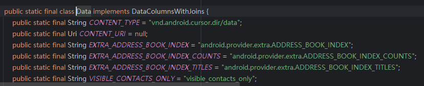
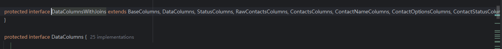
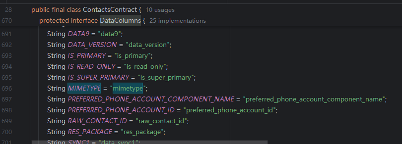

其余三个**Blocker**均为相同原因。


#### 问题：**Utility classes should not have public constructors。(创建工具类或者常量类要创建私有化构造方法)**

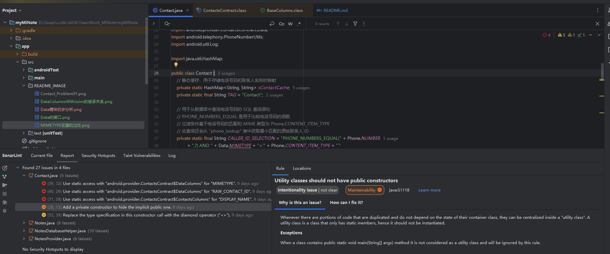

我们在新建工具类或者新建某个常量Const类，要创建一个私有的构造方法。因为我们不创带参构造的情况下，Java类会默认生成一个无参构造方法，但是一般工具类或者常量类是不允许通过new来实例化对象的，都是通过声明一个个静态方法或者变量，通过类名+ (.)点+ 方法来调用，所以注意像下图案例一样，要创建一个私有化的构造方法，覆盖掉原有的无参构造，让该类无法创建实例

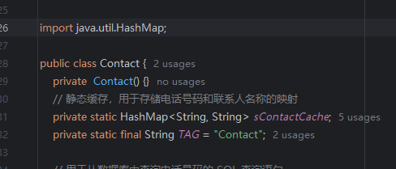

如图，增加无参私有构造函数后下划黄线消失，错误解决

## Notes.java类源码分析
###  **类结构**
   - **包名**: `net.micode.notes.data`。该包名表明该类属于一个笔记应用的数据管理部分。
   - **主类**: `Notes`，这是一个包含常量和内部类的工具类，定义了笔记应用的数据结构、数据库相关字段、URI等。
   - **内部类**:
     - **`DataConstants`**: 定义笔记数据类型的常量，用于标识文本笔记和通话笔记的内容类型。
     - **`NoteColumns`**: 是一个接口，定义了与笔记相关的数据库表字段（列名），例如 `ID`、`PARENT_ID`、`CREATED_DATE`、`MODIFIED_DATE` 等。
     - **`DataColumns`**: 是另一个接口，定义了数据相关的数据库表字段，特别用于描述笔记内容的多种格式。
     - **`TextNote`**: 实现了 `DataColumns` 接口，表示文本笔记的数据结构。它定义了 `MODE`、`CONTENT_TYPE` 等，用于区分文本笔记的内容和模式。
     - **`CallNote`**: 同样实现了 `DataColumns` 接口，表示通话笔记的数据结构，定义了 `CALL_DATE`、`PHONE_NUMBER` 等。

###  **对外提供的方法**
   由于 `Notes` 类没有提供实际的成员方法，它的对外接口主要是通过**静态常量和接口字段**来提供功能。
   - **URI 常量**: 
     - `CONTENT_NOTE_URI` 和 `CONTENT_DATA_URI` 用于访问笔记和数据内容，通过 `ContentProvider` 进行查询。
     - `TextNote.CONTENT_URI` 和 `CallNote.CONTENT_URI` 是访问具体文本笔记或通话笔记的 URI。
   - **接口字段**:
     - `NoteColumns` 和 `DataColumns` 定义了数据库中用于表示笔记和数据的字段。这些字段通常与数据库操作配合使用，如 `Cursor` 查询等。
   - **常量**: 
     - `TYPE_NOTE`, `TYPE_FOLDER`, `TYPE_SYSTEM` 等表示笔记类型，用于区分笔记、文件夹和系统条目。
     - `INTENT_EXTRA_*` 定义了各种传递数据的 `Intent` 附加信息键，用于在不同组件之间传递数据。

###  **实现的功能**
   该类的主要功能是为整个应用的数据存储和操作提供结构化的定义，尤其体现在笔记应用的数据库表结构以及通过 `ContentProvider` 进行的查询操作上。
   
   - **数据库表字段的定义**:
     - 通过 `NoteColumns` 和 `DataColumns` 接口，定义了笔记数据表和数据表中的各个字段。这为应用在与数据库交互时提供了标准化的字段名称，便于数据的存取、修改、删除等操作。
   
   - **不同类型笔记的数据类型**:
     - `TextNote` 和 `CallNote` 为文本笔记和通话笔记提供了各自的数据格式，并且通过 `MIME type` 来区分不同类型的数据记录。这使得应用可以存储和管理不同类型的笔记。
   
   - **ContentProvider的URI定义**:
     - 提供了笔记和数据查询的 `URI`，如 `CONTENT_NOTE_URI`、`CONTENT_DATA_URI`、`TextNote.CONTENT_URI`、`CallNote.CONTENT_URI`，用于通过 `ContentProvider` 进行数据的增删改查。
   
   - **其他功能**:
     - 类还定义了与小部件相关的类型，如 `TYPE_WIDGET_2X`、`TYPE_WIDGET_4X`，用于管理不同大小的小部件。

###  **使用SonarLint进行代码质量检测**:
#### 问题：**String literals should not be duplicated。(重复的字符串字面量)**
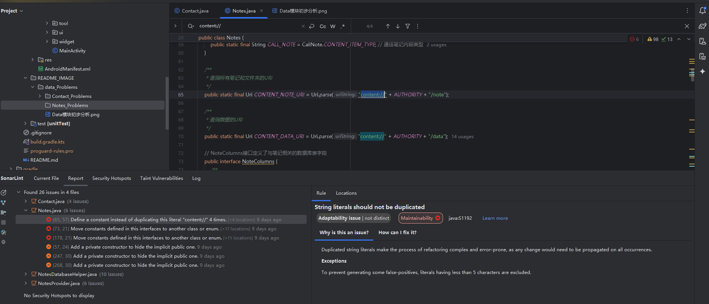
  在 Java 中，重复的字符串字面量（String literals）不仅会导致代码冗余，还可能增加内存使用、降低可维护性。
  **字符串重复的影响：**
  - **内存浪费:** 虽然 Java 会将字符串字面量存储在常量池中，但多个相同的字符串字面量出现在代码中会增加维护的难度，尤其当这些字符串需要修改时。
  - **可维护性差:** 如果同一个字符串字面量在多个地方硬编码，一旦这个字符串需要改变，必须手动在多个地方进行修改，容易出错。
  - **降低可读性:** 重复的字符串字面量使代码显得冗余，增加阅读和理解的难度。

这个问题非常明显，在这段代码中四个包含Uri的函数在它的参数中都使用了`content://`这一字符串，因此我们只需要将这个字符串使用变量保存起来即可实现重复使用，增强代码的可维护性、提高内存使用率

``` java
// 替换前
    public static final Uri CONTENT_NOTE_URI = Uri.parse("content://"  + AUTHORITY + "/note");

    public static final Uri CONTENT_DATA_URI = Uri.parse("content://"  + AUTHORITY + "/data");
    // ...
    public static final Uri CONTENT_URI = Uri.parse("content://"  + AUTHORITY + "/text_note");

    public static final Uri CONTENT_URI = Uri.parse("content://"  + AUTHORITY + "/call_note");

  //替换后
  //定义常量替换 "content://"
    private  static final String uriHead = "content://";
        public static final Uri CONTENT_NOTE_URI = Uri.parse(uriHead  + AUTHORITY + "/note");

    public static final Uri CONTENT_DATA_URI = Uri.parse(uriHead  + AUTHORITY + "/data");
    // ...
    public static final Uri CONTENT_URI = Uri.parse(uriHead  + AUTHORITY + "/text_note");

    public static final Uri CONTENT_URI = Uri.parse(uriHead  + AUTHORITY + "/call_note");
```

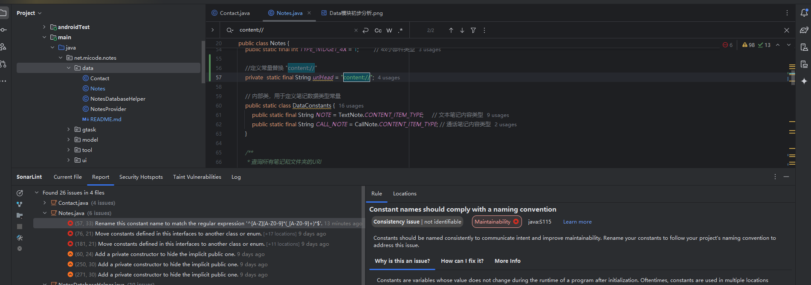

这里字符重复的错误消失，取而代之的是命名不规范错误，它要求使用全大写的命名格式，但这种明明不够美观，这里我更习惯使用阿里开发手册中推荐的小驼峰命名法进行命名，此"错误"之后不再修改


#### 问题：**Interfaces should not solely consist of constants(接口类中不能只有常数)**

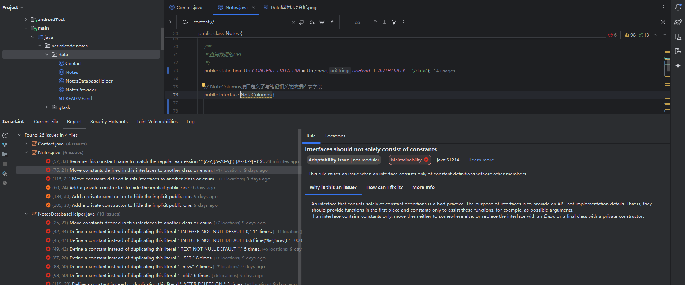

这种情况要么要加入方法要么使用枚举类，但是使用枚举类对外获取常量的方式会改变，这段代码的耦合度过高修改及其困难（使用该接口的代码段列举如下图）

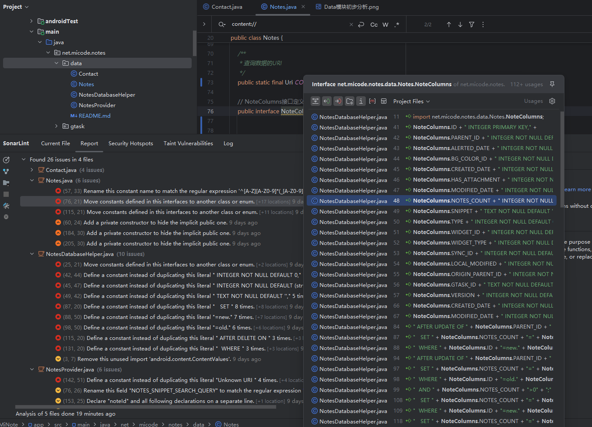

由此可见这段代码贯穿了整个app的各个部分，想要进行修改十分困难（**以此为鉴以此为鉴！！！**）
另外一个爆红问题与此相同。

#### 2024/10/03修改
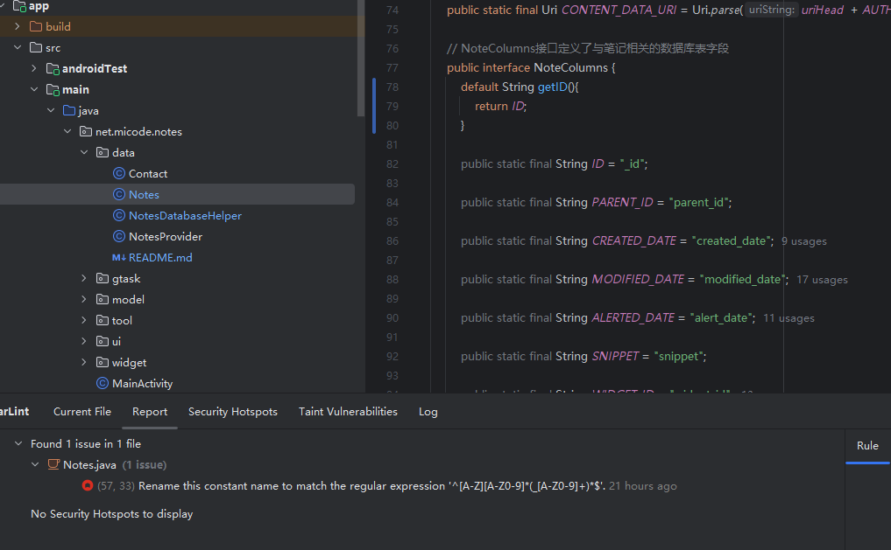
根据资料查阅得知在 Java 8 中，接口引入了 default 方法，允许你为接口中的某些方法提供默认实现。如果一个类实现了这个接口，并且不重写 default 方法，它将使用接口中的默认实现。


#### 问题 :**Utility classes should not have public constructors。(创建工具类或者常量类要创建私有化构造方法)**

同Contact.java模块中第二个问题，这三个**Critical**只需要增加private的无参构造函数即可解决。

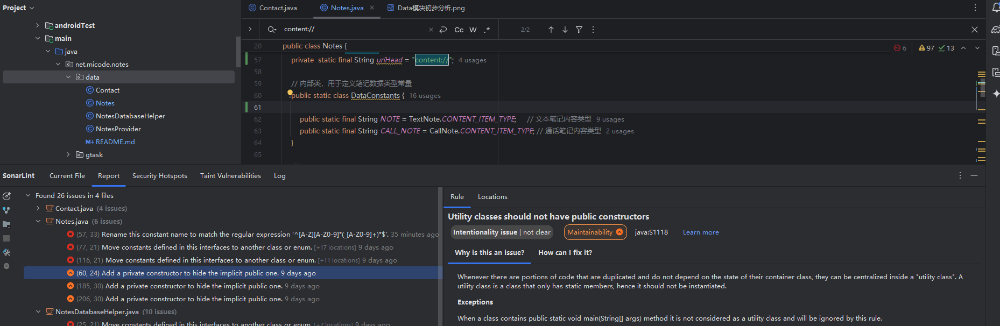
**爆红消失**，仅剩下命名不规范的提示。


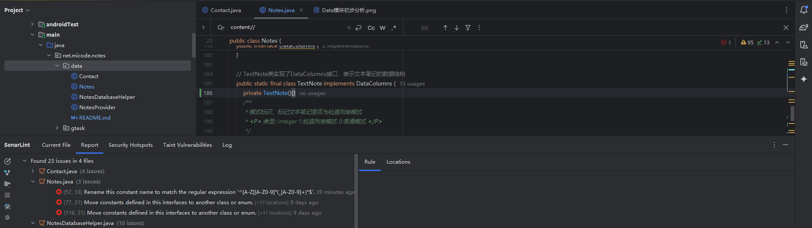

## NotesDataBasesHelper.java类源码分析
###  **类结构**

`NotesDatabaseHelper` 继承自 `SQLiteOpenHelper`，是一个帮助管理 SQLite 数据库的工具类，专门用于创建、升级、和维护 "note.db" 数据库。其结构如下：

- **类名**: `NotesDatabaseHelper`
- **成员变量**:
  - `DB_NAME`: 数据库名，常量，值为 `"note.db"`。
  - `DB_VERSION`: 数据库版本号，常量，值为 `4`。
  - `TABLE`: 定义了包含笔记和数据的表名的接口。
  - `mInstance`: 数据库实例，用于单例模式。
  - 多条 SQL 语句，用于创建表、索引和触发器。
  
- **构造方法**:
  - 私有构造函数 `NotesDatabaseHelper(Context context)`，通过调用父类构造器来初始化数据库。
  
- **静态方法**:
  - `getInstance(Context context)`: 获取单例的 `NotesDatabaseHelper` 实例，确保只存在一个数据库帮助类的实例。

- **覆写的方法**:
  - `onCreate(SQLiteDatabase db)`: 创建数据库并执行创建表、索引和触发器的 SQL 语句。
  - `onUpgrade(SQLiteDatabase db, int oldVersion, int newVersion)`: 在数据库版本升级时执行的代码。
  - `execSQL(String sql)`: 用于执行外部 SQL 语句的方法，供调试使用。

###  **对外提供的方法**

- **`getInstance(Context context)`**: 提供了一个全局获取 `NotesDatabaseHelper` 的实例的途径，使用了单例模式来确保只有一个数据库实例。
  
- **`onCreate(SQLiteDatabase db)`**: 在数据库创建时调用，主要负责表和触发器的创建。用户不需要直接调用此方法，SQLiteOpenHelper 会自动调用它。

- **`onUpgrade(SQLiteDatabase db, int oldVersion, int newVersion)`**: 在数据库版本升级时调用，用于执行与数据库版本相关的 SQL 更新操作。用户也不直接调用此方法。

- **`execSQL(String sql)`**: 直接提供了执行自定义 SQL 的接口，便于在调试或动态场景中调用数据库查询。

###  **实现的功能**

- **表的创建**: 通过 `onCreate` 方法执行了 SQL 语句，创建了笔记表 `note` 和数据表 `data`，并为数据表 `data` 创建了索引。

- **触发器的管理**: 该类定义了多条触发器，用于在更新、插入、删除数据时自动更新表的数据或执行相关操作。例如，`increase_folder_count_on_insert` 触发器会在插入新笔记时自动增加文件夹的笔记数量。

- **数据库升级**: 通过 `onUpgrade` 方法管理数据库版本升级时的表结构更新。在 `DB_VERSION` 为 4 时，增加了为 `data` 表的 `NOTE_ID` 创建索引。

- **单例模式**: 使用单例模式确保应用中所有操作都使用同一个 `NotesDatabaseHelper` 实例，避免多次创建数据库连接。

###  **使用SonarLint进行代码质量检测**:

#### 问题：**Interfaces should not solely consist of constants。接口不应仅由常量组成**
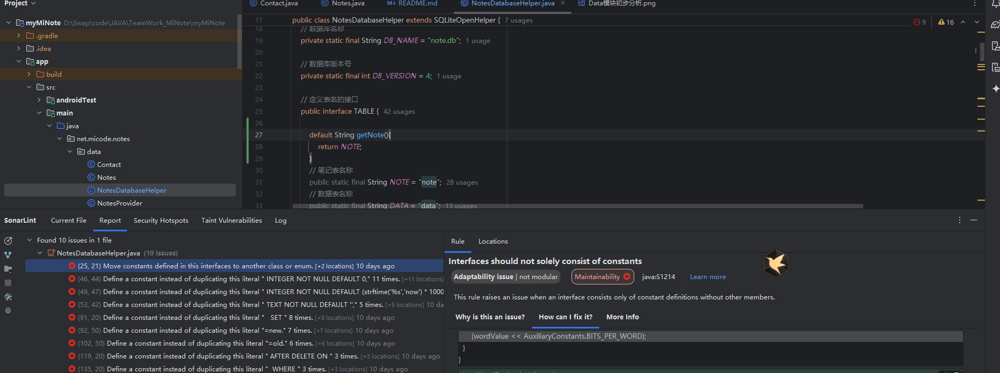

根据资料查阅得知在 Java 8 中，接口引入了 default 方法，允许你为接口中的某些方法提供默认实现。如果一个类实现了这个接口，并且不重写 default 方法，它将使用接口中的默认实现。

``` java
 public interface TABLE {

        default String getNote(){
            return NOTE;
        }
        // 笔记表名称
        public static final String NOTE = "note";
        // 数据表名称
        public static final String DATA = "data";
    }
```
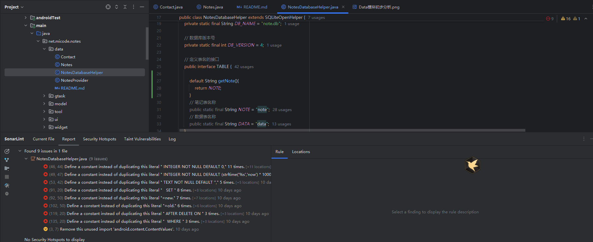
爆红消失

#### **String literals should not be duplicated。字符串重复使用**
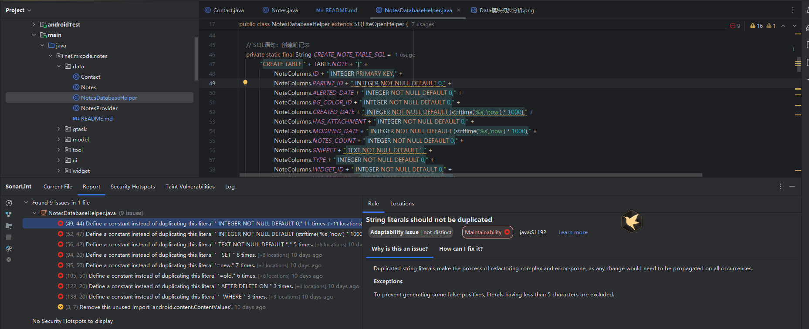
以下爆红均添加变量替代重复使用的字符串即可。

#### **Unnecessary imports should be removed，移除不必要的引入**
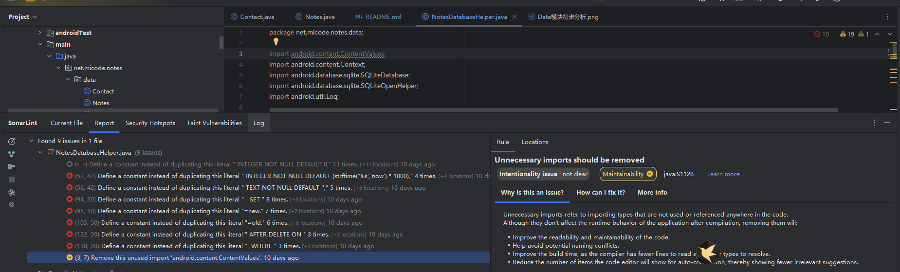

`import android.content.ContentValues;`在整段程序中没有使用，引入会降低程序效率，删掉这一行代码。

## NotesProvider.java类源码分析

###  **类结构分析：**

- **类名**: `NotesProvider`
  - 继承自 `ContentProvider`，是 Android 中提供跨应用访问数据的组件，用于对 `SQLite` 数据库进行增删改查操作。
  
- **成员变量**:
  - `mMatcher`：`UriMatcher` 对象，用于匹配 URI 与具体操作的映射关系。
  - `mHelper`：`NotesDatabaseHelper` 对象，用于获取数据库的实例，负责数据库的读写操作。
  - **常量**：定义了与 `UriMatcher` 相对应的 URI 类型（如 `URI_NOTE`, `URI_NOTE_ITEM` 等），用于区分操作类型。
  - `NOTES_SEARCH_PROJECTION` 和 `NOTES_SNIPPET_SEARCH_QUERY`：为搜索功能准备的查询和投影语句，用于处理特定搜索需求。
  
- **静态代码块**：
  - 使用 `UriMatcher` 添加 URI 规则，将不同路径的 URI 映射到不同的操作。

---

###  **对外提供的方法：**

- **`onCreate()`**:
  - 在 `ContentProvider` 被创建时调用，初始化数据库帮助类 `mHelper`。

- **`query()`**:
  - 实现数据库的查询操作，根据传入的 URI 匹配相应的数据表。
  - 通过 `mMatcher.match(uri)` 匹配 URI，对应不同的表（如 `NOTE`, `DATA`）和搜索需求。
  - 处理了常规的查询操作以及搜索建议功能，返回 `Cursor` 供外部使用。

- **`insert()`**:
  - 实现数据库的插入操作，支持对 `NOTE` 和 `DATA` 表的插入，并返回新插入的 URI。
  - 插入成功后，会通知 `ContentResolver`，触发监听数据变化的 UI 更新。

- **`delete()`**:
  - 实现数据库的删除操作，支持对 `NOTE` 和 `DATA` 表的数据进行删除。
  - 删除成功后，会触发相应的数据变化通知。

- **`update()`**:
  - 实现数据库的更新操作，支持对 `NOTE` 和 `DATA` 表的数据进行更新。
  - 更新成功后，通知 `ContentResolver` 更新数据。

- **`getType()`**:
  - 返回 MIME 类型。这个方法目前没有实现（返回 `null`），可以根据 URI 返回对应的数据类型。

---

###  **实现的功能：**

- **基本的数据库操作**：
  - 提供了 `query`, `insert`, `delete`, `update` 操作，分别实现了数据库的增删改查功能，能够操作 `NOTE` 和 `DATA` 两个表的数据。
  
- **数据搜索功能**：
  - 支持通过特定路径 `URI_SEARCH` 和 `URI_SEARCH_SUGGEST` 来进行内容搜索。
  - 使用 SQL 语句对 `NoteColumns.SNIPPET` 字段进行模糊查询，并返回搜索建议的结果，便于实现搜索提示功能。

- **版本控制**：
  - `increaseNoteVersion()` 方法用于在更新数据时，增加 `NOTE` 表中笔记的版本号。这是一个额外的功能，确保每次修改笔记都会记录版本变更。

---

###  **使用SonarLint进行代码质量检测**:


[返回源码分析报告页面](../../../../../../../README.md)