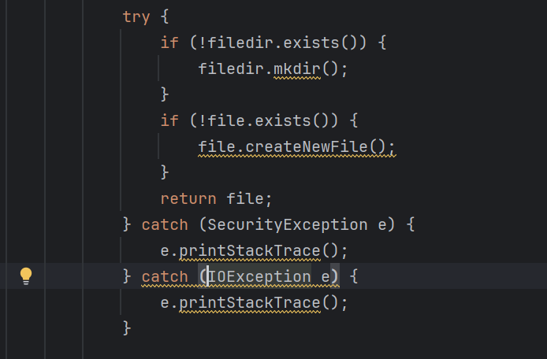

# tool文件夹源码分析

用**SonarLint**对**tool**模块中的四个文件进行一个大致的扫描，存在着诸多问题


其中包括if-else语句的过多嵌套导致的认知复杂度过高，以及诸多命名不规范问题和废弃函数导致的历史遗留问题。

#### 通有问题：“Cognitive Complexity of methods should not be too high”（方法的认知复杂度不宜太高）


**"Cognitive Complexity of methods should not be too high"** 是一种代码质量警告，通常是由静态代码分析工具（如 SonarQube 等）发出的。这种警告意味着某个方法的复杂度过高，可能难以理解、维护或测试。Cognitive Complexity 是一种衡量代码可读性和理解难度的度量标准。

### Cognitive Complexity 的评估标准包括：
1. **分支结构**（条件判断、循环、异常处理等）。
2. **嵌套层次**（嵌套越多，复杂度越高）。
3. **方法长度**（行数越多，复杂度越高）。

### 解决方案

1. **方法拆分**：
   - 如果某个方法过长或过于复杂，将其分成几个较小的、有明确职责的方法。这样可以减小每个方法的 Cognitive Complexity，并提升代码的可读性和复用性。

2. **减少嵌套**：
   - 过多的嵌套会增加复杂度。可以通过提早返回或使用 guard clauses（守卫子句）来减少不必要的嵌套。

3. **避免深层嵌套的循环和条件**：
   - 深层次嵌套不仅增加 Cognitive Complexity，也让代码难以调试。可以尝试将循环抽象为辅助方法，或者将多重条件拆分为独立的检查。

4. **使用面向对象的设计**：
   - 如果某个方法负责的逻辑过多，考虑通过对象的职责划分来简化代码。可以将一些业务逻辑委托给其他类，从而减少单个方法的复杂性。

5. **使用多态代替条件语句**：
   - 如果你的代码中有大量的 `switch/case` 或 `if/else` 分支，可以考虑使用多态来简化这些条件逻辑。

6. **使用早期返回**：
   - 使用早期返回可以减少嵌套的复杂性，提高代码的直观性。

## BackupUtils源码分析

这段代码实现了一个名为 `BackupUtils` 的类，负责将应用中的笔记数据导出为文本文件（可读格式），并将其存储在外部存储设备（如 SD 卡）上。代码涉及 Android 上的一些常见开发概念，如内容提供者（`ContentResolver`）、游标（`Cursor`）操作、文件操作等。

### 类结构
1. **`BackupUtils` 类**:
   - **作用**：这个类是一个单例类，用于导出笔记到文本文件。
   - **成员变量**：
     - `TAG`: 日志标识，用于记录日志。
     - `sInstance`: `BackupUtils` 的单例实例。
     - `mTextExport`: 一个 `TextExport` 类型的对象，负责导出文本的具体逻辑。
   
   - **状态码**：类中定义了一些常量，用来表示备份和恢复的状态：
     - `STATE_SD_CARD_UNMOUONTED`: SD 卡没有挂载。
     - `STATE_BACKUP_FILE_NOT_EXIST`: 备份文件不存在。
     - `STATE_DATA_DESTROIED`: 数据损坏。
     - `STATE_SYSTEM_ERROR`: 系统错误导致备份或恢复失败。
     - `STATE_SUCCESS`: 成功备份或恢复。

   - **对外方法**：
     - `getInstance(Context context)`: 单例获取 `BackupUtils` 实例。
     - `exportToText()`: 导出笔记数据为文本文件，并返回导出结果状态。
     - `getExportedTextFileName()`: 获取导出文件的名称。
     - `getExportedTextFileDir()`: 获取导出文件的路径。

2. **`TextExport` 内部类**:
   - **作用**：负责导出笔记和文件的详细实现。
   - **成员变量**：
     - `NOTE_PROJECTION`: 用于查询笔记的投影字段数组。
     - `DATA_PROJECTION`: 用于查询笔记数据的投影字段数组。
     - `TEXT_FORMAT`: 用于格式化输出文本的模板数组。
     - `mContext`: 上下文对象，提供资源和数据库访问等。
     - `mFileName`: 导出文件的名称。
     - `mFileDirectory`: 导出文件的路径。

   - **私有方法**：
     - `exportFolderToText(String folderId, PrintStream ps)`: 将指定文件夹中的所有笔记导出到文本中。
     - `exportNoteToText(String noteId, PrintStream ps)`: 将指定的笔记导出到文本中。
     - `getExportToTextPrintStream()`: 获取输出文本的 `PrintStream` 对象。
     - `generateFileMountedOnSDcard(Context context, int filePathResId, int fileNameFormatResId)`: 生成导出文本文件的路径和文件。

### 类的功能与实现
1. **单例模式**：`BackupUtils` 类采用了单例设计模式，确保类的实例在应用中只有一个。通过 `getInstance` 方法，获取单例对象。如果实例未初始化，它会创建一个新的实例。
   
2. **外部存储检测**：`externalStorageAvailable()` 方法用于检查外部存储设备是否可用，如 SD 卡是否挂载。这是为了确保导出的文件可以保存到外部存储。

3. **笔记导出逻辑**：
   - `exportToText()` 是对外提供的核心方法，负责将应用中的笔记数据导出为用户可读的文本文件。
   - 通过 `ContentResolver` 查询数据库中的笔记，并使用 `Cursor` 遍历每一条笔记记录。
   - 通过 `exportFolderToText` 和 `exportNoteToText`，分别导出文件夹中的笔记和单个笔记。
   - 每个笔记的内容按照 `TEXT_FORMAT` 进行格式化并输出到文本文件中。

4. **文本文件生成与保存**：
   - `getExportToTextPrintStream()` 方法负责生成保存导出文件的 `PrintStream`，该方法会生成文件路径，并确保目录和文件存在。如果文件不存在，则会创建新文件。
   - `generateFileMountedOnSDcard()` 方法生成具体的文件路径，包括文件名格式化部分，文件名包含当前日期等信息，确保每次导出的文件不会被覆盖。

### 对外提供的方法
- `exportToText()`: 这是对外暴露的导出功能接口，执行笔记导出操作，返回状态码，告知操作成功与否。
- `getExportedTextFileName()`: 获取导出的文本文件名称。
- `getExportedTextFileDir()`: 获取导出的文本文件路径。

### 实现的功能
1. **笔记导出**：将应用内的笔记数据导出为用户可读的文本文件，包含笔记的内容、创建和修改时间等信息。
   
2. **外部存储检查**：在执行文件导出前，会检查外部存储设备是否可用，以防止在没有存储设备的情况下执行导出操作。

3. **数据格式化输出**：导出的笔记按照特定格式进行输出，确保文件的可读性，并且区分不同类型的笔记内容（如通话记录、普通笔记等）。

4. **文件保存与异常处理**：系统会根据当前的日期等信息生成唯一的文件名，并保存在 SD 卡上。如果在生成或写入文件过程中出现异常，系统会记录错误日志并返回错误状态码。

###  **使用SonarLint进行代码质量检测**:

#### 问题一：“"private" methods called only by inner classes should be moved to those classes”（仅由内部类调用的 “private” 方法应移至这些类）


**"private methods called only by inner classes should be moved to those classes"** 是一种代码质量警告，通常由代码分析工具（如 SonarQube 等）提示。这个警告的意思是，当一个 `private` 方法只被某个内部类（inner class）使用时，这个方法应该被移到那个内部类中，而不是留在外部类中。

### 为什么这是个问题？
1. **可维护性**：当一个 `private` 方法只被内部类使用，但放在外部类中时，它会增加外部类的复杂性，使代码看起来更难理解。其他开发者可能会误解为这个方法被外部类的其他部分使用。
   
2. **封装性**：在面向对象编程中，封装性（encapsulation）是一个重要原则。如果一个方法只在内部类中使用，那么它应该被移动到这个内部类中，以减少外部类的责任，并提高封装性。

3. **代码组织性**：将方法放置在最相关的类中会使代码组织更加清晰。如果一个方法只与内部类相关，那么它应该属于该类的实现细节，而不应该在外部类中可见。

### 如何解决这个问题？
要解决这个问题，可以将该 `private` 方法移到内部类中，具体步骤如下：

### 1. **找到被内部类调用的 `private` 方法**
   找到那些只被内部类调用的 `private` 方法。

### 2. **将方法移动到内部类**
   如果该 `private` 方法只被内部类使用，你可以将它移到内部类中。

   **调整前**：


   **调整后**：


经过合并后黄色警告消失，问题解决

#### 问题二：“Return values should not be ignored when they contain the operation status code”（当返回值包含操作状态代码时，不应忽略这些值）

**"Return values should not be ignored when they contain the operation status code"** 是一种代码质量警告，通常由静态代码分析工具（例如 SonarQube 等）提示。这种问题意味着，代码中调用了一些返回操作状态的函数或方法，而这些返回值被忽略，没有进行适当的处理或检查。

### 为什么这是个问题？

1. **丢失错误信息**：许多函数或方法通过返回值告知调用者操作的结果或状态，例如是否成功、是否发生错误、错误的类型等。如果返回值被忽略，那么任何潜在的错误或问题都不会被处理。
   
2. **不可靠的操作流程**：如果操作状态没有被检查，程序可能会继续执行，而忽视了潜在的问题。这可能导致程序崩溃、数据不一致或安全漏洞。

3. **代码的可读性和维护性降低**：忽视返回值的代码会让其他开发人员不清楚操作是否成功，导致代码难以维护和调试。

**"Catches should be combined"** 是代码质量工具（如 SonarQube）发出的警告，表示你的代码中存在多个 `catch` 块捕获类似或相同的异常，可以将这些 `catch` 块合并。多个 `catch` 块处理相似的逻辑可能会导致冗余代码，增加维护的复杂性。

#### 问题三：“Catches should be combined”（捕获物应合并）

### 为什么这会成为问题？

1. **代码冗余**：多个 `catch` 块中处理相同的逻辑会导致代码重复，冗长而难以维护。
  
2. **可读性降低**：当你在多个地方写类似的 `catch` 代码块时，代码变得不够清晰，不容易理解。

3. **维护复杂性**：未来修改异常处理逻辑时，可能会遗漏修改其中某些重复的 `catch` 块，增加了出现 bug 的风险。

### 解决方法

将多个 `catch` 块合并，通过捕获多个异常并在同一个 `catch` 块中处理。

### 如何合并 `catch` 块？

在 Java 7 及以后，可以使用 **多异常捕获**（multi-catch），通过使用竖线 `|` 将多个异常类型合并在一个 `catch` 块中，避免重复的代码。

#### 未合并的 `catch` 块：


#### 改进后的示例（合并的 `catch` 块）：


### 详细解释

1. **多个异常类型**：在 `catch` 块中，可以用 `|` 操作符列出多个可能抛出的异常。例如，`IOException` 和 `FileNotFoundException` 都可以捕获在同一个 `catch` 块中，因为它们可能需要相同的处理逻辑。

2. **避免重复**：这种方式避免了为每个异常单独写一个 `catch` 块，并确保所有相似的异常类型都通过一个统一的处理逻辑进行处理。

经过合并后黄色警告消失，问题解决

## DataUtils源码分析

### 类结构

`DataUtils` 类位于 `net.micode.notes.tool` 包中，主要提供了针对 `ContentResolver` 的一系列静态工具方法，用于操作笔记和数据。这些方法封装了对笔记数据库的增删改查操作，涉及批量删除、移动、查询等功能。

### 对外提供的方法

1. **`batchDeleteNotes(ContentResolver resolver, HashSet<Long> ids)`**  
   - 批量删除笔记。

2. **`moveNoteToFoler(ContentResolver resolver, long id, long srcFolderId, long desFolderId)`**  
   - 移动单个笔记到指定文件夹。

3. **`batchMoveToFolder(ContentResolver resolver, HashSet<Long> ids, long folderId)`**  
   - 批量移动笔记到指定文件夹。

4. **`getUserFolderCount(ContentResolver resolver)`**  
   - 获取用户文件夹的数量，排除系统文件夹。

5. **`visibleInNoteDatabase(ContentResolver resolver, long noteId, int type)`**  
   - 检查某笔记 ID 是否在数据库中可见。

6. **`existInNoteDatabase(ContentResolver resolver, long noteId)`**  
   - 检查笔记 ID 是否存在于数据库中。

7. **`existInDataDatabase(ContentResolver resolver, long dataId)`**  
   - 检查数据 ID 是否存在于数据库中。

8. **`checkVisibleFolderName(ContentResolver resolver, String name)`**  
   - 检查文件夹名称是否在数据库中可见（即文件夹名是否已存在）。

9. **`getFolderNoteWidget(ContentResolver resolver, long folderId)`**  
   - 获取指定文件夹中的所有笔记的 Widget 信息。

10. **`getCallNumberByNoteId(ContentResolver resolver, long noteId)`**  
    - 获取与笔记 ID 相关联的电话号码。

11. **`getNoteIdByPhoneNumberAndCallDate(ContentResolver resolver, String phoneNumber, long callDate)`**  
    - 根据电话号码和通话日期获取笔记 ID。

12. **`getSnippetById(ContentResolver resolver, long noteId)`**  
    - 根据笔记 ID 获取笔记的摘要信息。

13. **`getFormattedSnippet(String snippet)`**  
    - 格式化笔记的摘要内容。

---

### 实现的功能

1. **批量删除笔记**
   - 接收笔记 ID 的集合，依次删除集合中的每个笔记，若删除失败，返回 `false`。通过批量操作提高效率，并确保系统根文件夹不会被删除。

2. **移动笔记**
   - 将指定笔记移动到目标文件夹，更新笔记的父文件夹 ID。

3. **批量移动笔记**
   - 与单个笔记的移动操作类似，但适用于多个笔记，批量更新数据库中的父文件夹 ID。

4. **用户文件夹数量获取**
   - 查询用户自定义的文件夹数量，排除系统和垃圾文件夹，返回用户自定义文件夹的总数。

5. **笔记可见性检查**
   - 查询数据库，判断某笔记是否存在且不在垃圾文件夹中。

6. **笔记是否存在**
   - 查询笔记数据库，判断给定的笔记 ID 是否存在。

7. **数据条目是否存在**
   - 查询数据数据库，判断给定的数据 ID 是否存在。

8. **文件夹名称存在性检查**
   - 检查数据库中是否存在与给定名称相同的文件夹，排除垃圾文件夹。

9. **获取文件夹内的 Widget 信息**
   - 查询指定文件夹中所有笔记的 Widget 信息（如 Widget ID 和 Widget 类型），并将其封装为对象集合返回。

10. **获取与笔记 ID 相关联的电话号码**
    - 查询数据数据库，获取与指定笔记 ID 相关联的电话号码。

11. **根据电话号码和通话日期查找笔记**
    - 查询通话记录，获取与指定电话号码和通话日期匹配的笔记 ID。

12. **获取笔记的摘要信息**
    - 根据笔记 ID 查询数据库，获取笔记的摘要内容。

13. **格式化笔记摘要**
    - 对笔记摘要进行简单的格式化操作，截取第一行并去除多余的换行符和空格。

###  **使用SonarLint进行代码质量检测**:

#### 问题一：“Boolean expressions should not be gratuitous”（布尔表达式不应是无端的）

**"Boolean expressions should not be gratuitous"** 是一种代码质量问题，通常是由静态代码分析工具（如 SonarQube）检测到的。这一问题的意思是，布尔表达式不应该包含多余或不必要的部分。冗余的布尔表达式会降低代码的可读性，增加复杂性，甚至可能引入逻辑错误。

### 问题的典型表现
不必要的布尔表达式通常表现为：
1. **重复的条件检查**。
2. **布尔值的直接比较**（例如 `if (isTrue == true)`）。
3. **复杂条件中的多余表达式**。

### 如何解决 "Boolean expressions should not be gratuitous" 问题
1. **简化布尔表达式**：避免不必要的比较、重复的条件和复杂的逻辑。
2. **去掉多余的逻辑运算**：如果某些条件在逻辑上是多余的，应该移除它们，保证代码清晰简洁。
3. **使用清晰、直接的布尔逻辑**：对于布尔值，直接使用而不是与 `true` 或 `false` 比较。也尽量避免不必要的三元运算符和取反操作。

### 解决结果
**优化前：**


**优化后：**


问题已成功解决，黄色警告消除。

#### 问题二：“Mergeable "if" statements should be combined”（应合并可合并的 “if” 语句）

**"Mergeable 'if' statements should be combined"** 是一种代码质量问题，通常由代码分析工具（如 SonarQube）提示。这一问题意味着多个可以合并的 `if` 语句没有被合理组合，导致了不必要的代码分支或复杂性。

### 问题的表现
多个独立的 `if` 语句共享相似的逻辑，通常可以通过合并来减少冗余代码，简化逻辑流。例如，两个条件不冲突，或者相邻的 `if` 语句都检查类似条件时，可以将它们合并。

### 何时不该合并
在某些情况下，虽然两个 `if` 语句看起来可以合并，但它们是出于逻辑或代码结构的需要而分开的。例如，两个 `if` 语句之间有其他重要的操作，或者它们处理的是完全不同的逻辑块。在这种情况下，最好保持它们独立，甚至可以通过重构来提高代码的可读性。

### 如何解决 "Mergeable 'if' statements should be combined" 问题
1. **逻辑检查**：如果发现两个或多个 `if` 语句在逻辑上相似，或者它们的条件可以通过一个复合条件来表达，考虑合并它们。
2. **使用逻辑运算符**：利用 `&&`、`||` 等逻辑运算符，将多个条件合并成一个布尔表达式。
3. **简化代码结构**：通过合并 `if` 语句，可以减少代码的分支复杂度，使代码更简洁、可读。

### 代码简化的好处
- **提高可读性**：减少了嵌套和重复逻辑，使代码结构更加清晰。
- **减少冗余**：合并条件可以减少重复的代码，减轻维护负担。
- **性能优化**：有时合并 `if` 语句能够避免不必要的多次条件检查，从而提高代码的性能（尽管性能提升通常较小）。

### 解决结果
**优化前：**


**优化后：**


问题已成功解决，黄色警告消除

## GTaskStringUtils源码分析

### 1. **类结构**

```java
public class GTaskStringUtils {
    // 各种字符串常量的定义
}
```

- 该类是一个 **工具类（Utility Class）**，主要目的是定义一系列常量，帮助处理 GTASK 的数据和相关操作。
- 这些常量是 **静态常量** (`static final`)，用于在不同的类和方法中复用。这种设计便于集中管理，并减少硬编码问题。

### 2. **对外提供的方法**

这个类 **没有提供任何方法**，它的唯一职责是存储 **字符串常量**，因此并没有对外暴露方法。该类仅用于提供各种 JSON 字段、操作类型以及与 GTASK 任务管理相关的其他字符串标识符。

### 3. **实现的功能**

虽然该类没有实现具体方法，但通过它的常量可以推断出它在 GTASK 任务系统中的作用。以下是对这些常量的作用和功能的分析：

1. **GTASK JSON 字段相关的常量**：
   - `GTASK_JSON_ACTION_ID`、`GTASK_JSON_ACTION_LIST`、`GTASK_JSON_ACTION_TYPE` 等常量是用于处理 GTASK JSON 数据中的字段名。
   - 这些常量可用于解析和生成 GTASK 任务的 JSON 数据，例如创建任务、更新任务等操作。

2. **GTASK 操作类型常量**：
   - `GTASK_JSON_ACTION_TYPE_CREATE`、`GTASK_JSON_ACTION_TYPE_GETALL`、`GTASK_JSON_ACTION_TYPE_MOVE` 等字符串用于指明特定的操作类型（如创建、获取所有任务、移动任务等）。这些操作类型可以用于不同的 API 调用或任务管理逻辑中。

3. **任务和列表相关的常量**：
   - `GTASK_JSON_LIST_ID`、`GTASK_JSON_TASKS`、`GTASK_JSON_NAME` 等常量用于 GTASK 中的任务（Task）和列表（List）的标识与处理。
   - 比如 `GTASK_JSON_LIST_ID` 可以表示任务所属的列表，`GTASK_JSON_TASKS` 可以表示任务的集合，`GTASK_JSON_NAME` 则是任务或列表的名字。

4. **同步与元数据相关的常量**：
   - `GTASK_JSON_LATEST_SYNC_POINT`、`META_HEAD_GTASK_ID` 等用于表示同步点和元数据头信息。
   - 这些常量用于处理任务同步时的关键数据和任务的元数据信息。尤其是在多设备同步和数据备份等场景中，`GTASK_JSON_LATEST_SYNC_POINT` 表示任务最后一次同步的时间点。

5. **MIUI 相关的常量**：
   - `MIUI_FOLDER_PREFFIX` 是 MIUI 笔记应用特定的文件夹前缀，用于将 GTASK 与 MIUI Notes 集成时识别特定文件夹。
   - `FOLDER_DEFAULT`、`FOLDER_CALL_NOTE` 是一些预设的文件夹名，用于标识默认文件夹和与通话记录相关的文件夹。

6. **其他常量**：
   - `GTASK_JSON_TYPE_GROUP`、`GTASK_JSON_TYPE_TASK`：用于区分任务的类型，表示任务属于“组”或“单个任务”。
   - `META_NOTE_NAME`：是一个元数据注释，用于标识某些不可更改或删除的笔记数据。

###  **使用SonarLint进行代码质量检测**:

#### 问题：“Utility classes should not have public constructors”（Utility 类不应具有公共构造函数）

"Utility classes should not have public constructors" 是一种代码设计上的问题，通常出现在工具类（Utility Class）中。工具类一般只包含静态方法或静态常量，目的是为其他类提供公共功能，**不需要实例化**。当工具类有一个**公共构造函数**时，其他代码可能错误地创建该类的实例，这是不必要的，且与工具类的设计意图相悖。

### 为什么这是个问题？
1. **浪费资源**：实例化工具类会消耗不必要的内存，因为工具类不需要持有状态。
2. **不符合设计意图**：工具类是为复用而设计的，应该通过静态成员或方法调用，而不是通过实例化对象。
3. **容易误用**：如果有公共构造函数，其他开发者可能会误认为该类需要实例化，导致不必要的代码复杂度和误用。

### 解决方法：

**将构造函数设为 `private`**：
   - 通过将工具类的构造函数设为 `private`，防止类被实例化。这符合工具类的设计意图，即只包含静态方法或常量。
   - 这样，工具类就只能通过类名直接调用其静态方法或常量。

### 解释：
1. **`private GTaskStringUtils()`**：这个私有构造函数防止外部实例化该类。
2. **`throw new UnsupportedOperationException("Utility class")`**：这条语句在有人试图反射创建该类时抛出异常，进一步确保类不会被实例化。

### 解决结果：
**优化前：**


**优化后：**


问题已成功解决，黄色警告消除

## ResourceParcer源码分析

该代码是一个 Android 项目中的工具类 `ResourceParser`，用于解析与界面相关的资源，如背景颜色、字体大小等。代码中的类和方法主要围绕不同 UI 组件（如便签的背景、字体样式、Widget 等）的资源进行处理和获取。

### 类结构：
- **顶级类 `ResourceParser`**：封装了与资源解析相关的逻辑，包含常量定义以及若干内部类，分别处理便签背景、字体样式、Widget 背景等资源。
  
- **内部类 `NoteBgResources`**：处理便签编辑界面的背景资源。
  - `BG_EDIT_RESOURCES[]`：存储便签编辑界面的背景资源（如黄色、蓝色等）。
  - `BG_EDIT_TITLE_RESOURCES[]`：存储便签编辑标题栏的背景资源。
  - `getNoteBgResource(int id)`：获取指定背景资源。
  - `getNoteTitleBgResource(int id)`：获取指定标题背景资源。

- **内部类 `NoteItemBgResources`**：处理便签列表项的背景资源。
  - `BG_FIRST_RESOURCES[]`、`BG_NORMAL_RESOURCES[]`、`BG_LAST_RESOURCES[]`、`BG_SINGLE_RESOURCES[]`：分别存储列表项的不同状态（首个、正常、最后、单个）的背景资源。
  - 提供了不同方法（如 `getNoteBgFirstRes(int id)`、`getNoteBgNormalRes(int id)`）来获取这些资源。

- **内部类 `WidgetBgResources`**：处理 2x2 和 4x4 大小的 Widget 背景资源。
  - `BG_2X_RESOURCES[]` 和 `BG_4X_RESOURCES[]`：分别存储 2x2 和 4x4 Widget 的背景资源。
  - 提供了 `getWidget2xBgResource(int id)` 和 `getWidget4xBgResource(int id)` 方法来获取相应的资源。

- **内部类 `TextAppearanceResources`**：处理文本外观（字体大小）的资源。
  - `TEXTAPPEARANCE_RESOURCES[]`：存储文本外观资源。
  - 提供了 `getTexAppearanceResource(int id)` 来获取字体样式资源。
  - `getResourcesSize()`：返回资源总数。

### 对外提供的方法：

1. **`getNoteBgResource(int id)`**：从 `NoteBgResources` 获取指定 id 的背景资源。
2. **`getNoteTitleBgResource(int id)`**：从 `NoteBgResources` 获取指定 id 的标题背景资源。
3. **`getDefaultBgId(Context context)`**：根据用户的偏好设置返回默认的背景颜色 ID。
4. **`getNoteBgFirstRes(int id)`、`getNoteBgLastRes(int id)`、`getNoteBgSingleRes(int id)`、`getNoteBgNormalRes(int id)`**：从 `NoteItemBgResources` 中获取便签列表项的背景资源。
5. **`getFolderBgRes()`**：获取文件夹背景资源。
6. **`getWidget2xBgResource(int id)` 和 `getWidget4xBgResource(int id)`**：分别获取 2x2 和 4x4 Widget 的背景资源。
7. **`getTexAppearanceResource(int id)`**：获取指定字体样式资源。
8. **`getResourcesSize()`**：获取字体样式资源的总数。

### 实现的功能：
- 该类主要为 Android 应用中与便签、Widget 和文本显示相关的界面元素提供资源的**解析和获取**功能。包括：
  - 根据用户偏好设置获取背景颜色。
  - 根据不同的场景（编辑界面、列表项、Widget）提供相应的背景资源。
  - 提供不同尺寸的文本外观资源。

###  **使用SonarLint进行代码质量检测**:

#### 问题：存在诸多处“Utility classes should not have public constructors”（Utility 类不应具有公共构造函数）


**解决方法：** 具体与**GTaskStringUtils**部分的代码问题相同，均已成功解决，黄色警告消除