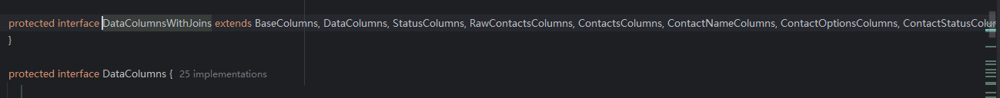

# ui文件夹源码分析

先用**SonarLint**整体扫一遍，发现data模块中的四个文件中有27个问题。


但这其中有很多问题是因时代原因和重复的。所以需要人工复审一下。复审就很容易知道，其中一大半都是命名规范，或是因时代导致当时的函数如今被废弃了。


在SonarQube中，代码缺陷分为以下五个级别：
- **Blocker**: 极有可能影响应用程序表现的错误;
- **Critical**: 可能影响应用程序表现的错误和表示安全缺陷的问题;
- **Major**:严重影响开发者效率的质量缺陷:.
- **Minor**:轻微影响开发者效率的质量缺陷;.
- **Info**:不是错误或者质量缺陷。
所以在下面代码质量检测模块中将主要分析缺陷等级为Blocker、Critical、Major的部分：

## AlarmAlertActivity.java 源码分析

### 类结构

- **类名**: `AlarmAlertActivity`
- **包名**: `net.micode.notes.ui`
- **依赖库**:
  - Android SDK classes:
    - `Activity`: 基础的活动类。
    - `AlertDialog`, `DialogInterface`: 用于创建和管理对话框。
    - `AudioManager`, `MediaPlayer`, `RingtoneManager`, `Uri`: 用于播放媒体和管理音频流。
    - `PowerManager`: 用于管理设备电源状态。
    - `Window`, `WindowManager`: 用于管理窗口的显示属性。
    - `Intent`: 用于跨进程、跨组件通信。
    - `Bundle`: 用于存储和恢复活动状态。
    - `Settings`: 用于访问设备的全局系统设置。
  - 项目依赖:
    - `net.micode.notes.R`: 资源引用。
    - `net.micode.notes.data.Notes`: 数据层类。
    - `net.micode.notes.tool.DataUtils`: 工具类，用于数据处理。

### 成员变量

- `mNoteId`: `long`类型，用于存储当前笔记的ID。
- `mSnippet`: `String`类型，存储当前笔记的简要内容（片段）。
- `SNIPPET_PREW_MAX_LEN`: `int`类型常量，用于限制片段显示的最大长度。
- `mPlayer`: `MediaPlayer`类型，用于播放闹钟铃声。

### 方法

- **`onCreate(Bundle savedInstanceState)`**: 初始化活动，处理窗口属性，解析Intent数据，显示提醒对话框并播放闹钟铃声。
  - 使用`Window`管理窗口属性，确保在锁屏情况下展示出来。
  - 解析`Intent`以获取笔记ID和片段内容，调用`DataUtils.getSnippetById()`获得片段。
  - 检查笔记在数据库中是否可见，决定是否显示提醒对话框和播放闹钟。

- **`isScreenOn()`**: 判断设备屏幕状态。
  - 使用`PowerManager`检查屏幕是否打开。

- **`playAlarmSound()`**: 播放默认闹钟铃声。
  - 获取默认闹钟声音URI。
  - 检查系统设置中静音模式影响的音频流。
  - 配置`MediaPlayer`的音频流并启动播放。

- **`showActionDialog()`**: 显示提醒对话框。
  - 创建并配置`AlertDialog`，显示笔记片段。
  - 为用户提供选择进入编辑界面或仅关闭提醒的操作。

- **`onClick(DialogInterface dialog, int which)`**: 处理用户对对话框按钮的操作。
  - 处理"进入"按钮点击事件，启动`NoteEditActivity`用于编辑笔记。

- **`onDismiss(DialogInterface dialog)`**: 对话框被关闭时调用。
  - 停止闹钟铃声，关闭活动。

- **`stopAlarmSound()`**: 停止播放闹钟铃声。
  - 停止并释放`MediaPlayer`资源。


### 实现的功能

- **屏幕唤醒**:
  - 在设备处于锁屏状态时，通过设置`Window`属性，唤醒屏幕并确保Activity在锁屏界面上显示。

- **笔记数据处理**:
  - 从`Intent`中获取传递的笔记ID，通过`DataUtils.getSnippetById()`提取笔记的简要内容，并截取至最大长度，以便在提醒对话框中显示。

- **铃声播放**:
  - 使用`MediaPlayer`播放系统默认的闹钟铃声，通过设置音频流类型，考虑到设备的静音模式，确保铃声能够在各种音频设置下合适播放。

- **用户界面交互**:
  - 创建并显示`AlertDialog`，在闹钟触发时让用户选择接下来的动作：确认提醒已知晓，或者进入应用编辑具体提醒笔记。

- **安全退出机制**:
  - 对于用户交互后的处理，通过实现`onDismiss()`，在对话框关闭时停止铃声播放，并结束当前Activity，防止资源泄漏。

- **屏幕状态判断**:
  - 通过`PowerManager`判断设备的屏幕状态，以便根据屏幕是否点亮，决定显示不同的对话框按钮选项。 

- **异常处理**:
  - 在解析Intent数据和播放音频时，使用`try-catch`捕获可能的异常，确保任何潜在的错误不会导致应用崩溃，并打印异常堆栈信息以辅助调试。

###  **使用SonarLint进行代码质量检测**:

#### 问题：**Combine this catch with the one at line 126, which has the same body.**

该问题指出在`catch`语句中存在多个具有相同处理逻辑的异常捕获块。SonarLint建议将这些异常统一到一个`catch`块中，以简化代码结构和提高可读性。

在Java 7及更高版本中，可以使用多异常捕获的功能，通过使用竖线符号`|`将多个异常合并为一个`catch`块，从而避免代码重复和简化异常处理流程。

##### 示例：

**不符合要求的代码示例：**

```java
try {
    // ... 可能抛出多个异常的代码 ...
} catch (IllegalArgumentException e) {
    e.printStackTrace();
} catch (SecurityException e) {
    e.printStackTrace();
}
```

在上面的代码中，`catch`块分别捕获了`IllegalArgumentException`和`SecurityException`，但它们都调用了相同的处理方法`e.printStackTrace()`。

**符合要求的解决方案：**

```java
try {
    // ... 可能抛出多个异常的代码 ...
} catch (IllegalArgumentException | SecurityException e) {
    e.printStackTrace();  // 将具有相同行为的异常合并到单一的 catch 块中
}
```

在改进后的代码中，使用多异常捕获减少了重复代码，提高了代码的清晰度和可维护性。此方式适用于逻辑处理相同的不同异常情况，从而实现统一的异常管理。





其余三个**Minor**均为相同原因。


## AlarmInitReceiver.java 源码分析

### 类结构

- **类名**: `AlarmInitReceiver`
- **包名**: `net.micode.notes.ui`
- **依赖库**:
  - Android SDK classes:
    - `BroadcastReceiver`: 用于接收和处理广播消息。
    - `AlarmManager`: 用于设置警报。
    - `PendingIntent`: 用于创建将在未来执行的意图。
    - `ContentUris`: 用于处理内容URI。
    - `Context`: 提供应用环境信息。
    - `Intent`: 用于跨进程、跨组件通信。
    - `Cursor`: 用于操作数据库查询的结果集。

- 项目依赖:
  - `net.micode.notes.data.Notes`: 包含应用的数据库内容提供者以及定义的常量。
  - `net.micode.notes.data.Notes.NoteColumns`: 提供访问笔记数据表的列名。

### 成员变量

- `PROJECTION`: `String[]`类型，定义了需要从数据库中获取的数据列，即笔记ID和提醒时间。
- `COLUMN_ID`: `int`类型常量，表示笔记ID的查询结果列索引。
- `COLUMN_ALERTED_DATE`: `int`类型常量，表示提醒时间的查询结果列索引。

### 方法

- **`onReceive(Context context, Intent intent)`**: 处理接收到的广播，负责重新初始化未过期的笔记提醒。
  - 使用当前系统时间`currentDate`来过滤已经过期的笔记提醒。
  - 使用内容解析器通过`ContentResolver.query()`方法查询出所有还未触发的提醒。
  - 查询条件为提醒时间（`NoteColumns.ALERTED_DATE`）大于当前系统时间，并且类型为笔记（`NoteColumns.TYPE`）。
  - 遍历查询结果，通过提醒时间设置每个笔记的闹钟。
  - 为每个闹钟创建一个`PendingIntent`对象，携带每个笔记的ID用以识别。
  - 使用`AlarmManager`设置系统闹钟，当达到提醒时间时会唤醒设备并触发定制的广播接收器`AlarmReceiver`。

### 实现的功能

- **广播接收**:
  - 继承`BroadcastReceiver`，实现`onReceive`方法，用于处理设备启动或应用重启时系统发送的初始化广播，确保所有有效的笔记提醒都被重新注册。

- **数据库查询与处理**:
  - 从应用的笔记内容提供者中查询出所有需要重新注册提醒的笔记。
  - 使用`Cursor`遍历查询结果并提取出笔记ID和提醒时间。

- **PendingIntent 与AlarmManager**:
  - 为每个未过期的提醒创建一个`PendingIntent`，保证在指定的时间点，Android系统能够调用`AlarmReceiver`。
  - `AlarmManager`使用`RTC_WAKEUP`类型设置闹钟，确保在设备休眠时也会被唤醒以触发提醒。

- **资源管理**:
  - 在使用完查询结果后，确保关闭`Cursor`以释放资源，并避免潜在的内存泄漏。

`AlarmInitReceiver`类的主要任务是确保笔记应用在重启后，所有提前设置的提醒能够按时触发，即使在设备重启这样的情况下，也能够保证提醒功能的持久性和稳定性。


## AlarmReceiver.java 源码分析

### 类结构

- **类名**: `AlarmReceiver`
- **包名**: `net.micode.notes.ui`
- **依赖库**:
  - Android SDK classes:
    - `BroadcastReceiver`: Android系统提供的用于接收广播消息的基础类。
    - `Context`: Android应用的全局上下文环境。
    - `Intent`: 用于在组件间传递消息或数据。

### 方法

- **`onReceive(Context context, Intent intent)`**: 当广播接收器接收到广播时被调用。
  - 用于处理闹钟相关的广播事件。
  - 将接收到的`Intent`配置为启动`AlarmAlertActivity`。
  - 通过设置`Intent`的目标类为`AlarmAlertActivity`，使得接收到广播后启动的活动指定为闹钟提醒界面。
  - 使用`addFlags(Intent.FLAG_ACTIVITY_NEW_TASK)`确保启动的活动以新任务的形式进行，这一标志用于在某些情况下，如从非活动上下文启动活动时，保证活动能够正确地启动。
  - 调用`context.startActivity(intent)`开启`AlarmAlertActivity`，让用户能够查看闹钟提醒。

### 实现的功能

- **广播接收**:
  - 作为一个`BroadcastReceiver`，`AlarmReceiver`用于监听系统或应用内的特定广播事件，特别是与闹钟提醒相关的广播。

- **活动启动**:
  - 在接收到合适的广播后，`AlarmReceiver`负责启动`AlarmAlertActivity`，以确保用户能在合适的时间查看到提醒信息。
  - 通过设置Intent的类和标志属性，达到在不同的任务和上下文环境下成功启动活动的目的。

###  **使用SonarLint进行代码质量检测**:

未检测到缺陷

## DateTimePicker.java 源码分析

### 类结构

- **类名**: `DateTimePicker`
- **包名**: `net.micode.notes.ui`
- **依赖库**:
  - Android SDK classes:
    - `Context`: 用于获取环境信息。
    - `View`, `FrameLayout`: 用于创建自定义的UI组件。
    - `DateFormat`, `DateFormatSymbols`, `Calendar`: 用于日期和时间的处理。
    - `NumberPicker`: 用于创建数值选择器UI组件。
  - 项目依赖:
    - `net.micode.notes.R`: 资源引用，用于访问应用中的布局和字符串等资源。

### 成员变量

- **常量**:
  - `DEFAULT_ENABLE_STATE`, `HOURS_IN_HALF_DAY`, `HOURS_IN_ALL_DAY`: 时间相关的常量。
  - `DATE_SPINNER_MIN_VAL` 等: 各个`NumberPicker`控件的取值范围常量。

- **控件对象**:
  - `mDateSpinner`, `mHourSpinner`, `mMinuteSpinner`, `mAmPmSpinner`: 分别对应日期、小时、分钟和 AM/PM 的选择器控件。

- **逻辑控制**:
  - `mDate`: `Calendar`对象，用于存储和处理当前选定的日期时间。
  - `mDateDisplayValues`: 日期选择器中显示的日期字符串数组。
  - `mIsAm`, `mIs24HourView`: 布尔值用于标识当前时间格式（AM/PM或24小时）。
  - `mIsEnabled`, `mInitialising`: 用于标识选择器当前是否可用及是否正在初始化。

- **监听器**:
  - `mOnDateTimeChangedListener`: 接口类型的监听器，用于在日期时间变化时，通知外部回调。
  - 各种`NumberPicker.OnValueChangeListener`实现，用于监听各个选择器的数值变化。

### 方法

- **构造方法**:
  - `DateTimePicker(Context context)`, `DateTimePicker(Context context, long date)`:
    初始化控件和监听器，设置初始日期时间，决定使用AM/PM 还是24小时格式。
  
- **控件初始化和UI更新**:
  - `updateDateControl()`, `updateHourControl()`, `updateAmPmControl()`:
    更新各个控件的显示内容，确保控件与当前选择的日期时间一致。

- **时间变更逻辑**:
  - 各个`NumberPicker.OnValueChangeListener`的实现：针对日期、小时、分钟及AM/PM的改变进行处理与界面刷新。

- **获取和设置当前时间**:
  - `getCurrentDateInTimeMillis()`, `setCurrentDate(long date)`, `setCurrentDate(int year, int month, int dayOfMonth, int hourOfDay, int minute)`:
    用于获取和设置当前选择的日期时间。

- **回调处理**:
  - `setOnDateTimeChangedListener(OnDateTimeChangedListener callback)`: 设置外部回调。
  - `onDateTimeChanged()`: 内部调用回调，通知日期时间的变化。
### 实现的功能

- **日期和时间选择**:
  - `DateTimePicker`提供一个界面控件，允许用户选择和设置日期与时间。它通过`NumberPicker`控件提供日期、小时、分钟及AM/PM选择，使用户可以轻松调整时间。

- **格式管理**:
  - 支持24小时格式与12小时AM/PM格式的转换与显示。根据用户偏好设置，控件会自动调整小时选择器和AM/PM选择器的显示方式。

- **日期自动调整**:
  - 当用户在选择器中选择小时或分钟，并引起日期变更时, 例如由23:59变为00:00，控件会自动调整日期，确保选择合理且连贯。例如通过增加一天或减少一天来反映时间变更后的日期调整。

- **时间变化响应监听**:
  - 提供`OnDateTimeChangedListener`接口，当用户更改选择的日期或时间后，控件会触发该接口，允许外部响应控件的变化，支持实时更新显示或其他逻辑处理。

- **自定义时间设置**:
  - 允许外部通过方法`setCurrentDate()`，传递年、月、日、小时和分钟进行设置，方便地初始化或更新日期时间选择器的显示。

- **支持国际化显示**:
  - 使用`DateFormatSymbols`来获取AM和PM的本地化字符串，确保控件在不同语言环境下能够正确显示AM/PM标识符。

- **启用/禁用功能**:
  - 支持通过代码动态启用或禁用控件，使其具备灵活性，以满足应用中不同场景下的需求。

- **初始化状态管理**:
  - 在构造并设置初始值时，通过`mInitialising`来标识初始化阶段，避免不必要的回调触发，并确保组件状态正确配置，不干扰初始化逻辑。
###  **使用SonarLint进行代码质量检测**:
#### 问题：**Move this method into the anonymous class declared at line 118.**

在`DateTimePicker`类中，SonarLint建议将`getCurrentHour()`方法移到第118行定义的匿名类中。该建议通常意味着方法的使用范围仅限于该匿名类的上下文中，因此为了代码的内聚性和可读性，应该将这个方法内联到匿名类中。

##### SonarLint 问题示例分析：

- **不符合要求的代码示例**：
  ```java
  public class Outie {
    private int i = 0;

    private void increment() {  // Noncompliant
      i++;
    }

    public class Innie {
      public void doTheThing() {
        Outie.this.increment();
      }
    }
  }
  ```
  在这个示例中，`increment()`方法在外部类`Outie`中声明，但仅在内部类`Innie`中使用。这样设计将方法与其唯一使用上下文分离，不利于代码的局部性和理解。

- **符合要求的解决方案**：
  ```java
  public class Outie {
    private int i = 0;

    public class Innie {
      public void doTheThing() {
        increment();
      }

      private void increment() {
        Outie.this.i++;
      }
    }
  }
  ```
  在解决方案中，`increment()`方法移到了`Innie`内部，这样所有逻辑都集中在同一个上下文中，从而增强了代码的内聚性和可维护性。

##### 应用到 `DateTimePicker` 中的建议：

在`DateTimePicker`中，根据SonarLint的建议，如果`getCurrentHour()`方法仅在第118行的匿名类上下文内使用，应将其移入该匿名类中。这样一来，方法的使用范围和实现细节都集中在一起，减少了不同上下文之间的依赖，提高了代码的集中度和可读性。

## DateTimePickerDialog.java 源码分析

### 类结构

- **类名**: `DateTimePickerDialog`
- **包名**: `net.micode.notes.ui`
- **依赖库**:
  - Android SDK classes:
    - `AlertDialog`, `DialogInterface`: 用于创建和管理对话框及其按钮事件。
    - `Context`: 提供各种与应用环境相关的信息。
    - `Calendar`: 用于操作日期和时间。
    - `DateFormat`, `DateUtils`: 用于格式化日期和时间。
  - 项目依赖:
    - `net.micode.notes.R`: 资源引用。
    - `net.micode.notes.ui.DateTimePicker`: 自定义日期时间选择器组件。

### 成员变量

- `mDate`: `Calendar`类型，用于存储和操作选择的日期和时间。
- `mIs24HourView`: `boolean`类型，标识是否采用24小时制显示时间。
- `mOnDateTimeSetListener`: `OnDateTimeSetListener`接口的引用，用于监听用户设置新的日期和时间。
- `mDateTimePicker`: `DateTimePicker`类型，自定义控件，用于选择日期和时间。

### 嵌套接口

- **`OnDateTimeSetListener`**: 接口定义了一个方法`OnDateTimeSet`，用于处理用户在对话框中设置的日期和时间。

### 方法

- **`DateTimePickerDialog(Context context, long date)`**: 构造函数，初始化对话框及其控件，设置初始日期和时间。
  - 创建并配置`DateTimePicker`实例，通过`setOnDateTimeChangedListener`更新`mDate`实例。
  - 设置对话框的确认和取消按钮，并根据系统设置来配置12小时或24小时模式。
  - 初始化对话框标题以显示当前选定的日期和时间。

- **`set24HourView(boolean is24HourView)`**: 设定是否使用24小时制，以此影响时间的显示格式。

- **`setOnDateTimeSetListener(OnDateTimeSetListener callBack)`**: 注册设置日期时间后的回调监听器。

- **`updateTitle(long date)`**: 更新对话框标题展示所选的日期和时间。
  - 生成格式化标志，决定日期和时间的格式。
  - 使用`DateUtils.formatDateTime`来设置格式化日期和时间作为对话框标题。

- **`onClick(DialogInterface arg0, int arg1)`**: 处理确认按钮的点击事件。
  - 在点击确认按钮时，如果设置了监听器，就调用`mOnDateTimeSetListener.OnDateTimeSet`传递当前选择的日期和时间。
  ### 实现的功能

- **自定义日期和时间选择**:
  - 通过集成`DateTimePicker`控件，提供一个灵活的界面，供用户选择所需的日期和时间。

- **日期时间的即时更新**:
  - 利用`Calendar`对象和`DateTimePicker`组件的联动，监听日期和时间的更改事件，实时更新`mDate`和对话框标题。

- **支持12/24小时制**:
  - 根据系统设置或用户偏好，指定并应用12小时或24小时制格式显示时间，确保时间显示符合用户习惯。

- **灵活的对话框标题更新**:
  - 利用`DateUtils`为对话框设置动态标题，显示选定的完整日期和时间，提供直观的用户信息反馈。

- **回调机制**:
  - 设计`OnDateTimeSetListener`接口，让调用者能够在用户确认选择时获取具体的日期和时间，通过回调机制实现灵活定制。

- **直观的用户交互**:
  - 提供了确认和取消两个主要操作按钮，用户可以在确认选择日期和时间后触发事件，或取消操作。

- **初始化参数设置**:
  - 对话框在创建时允许设置初始日期和时间，适用于编辑现有事件或调度任务的场景。
  ### 使用SonarLint进行代码质量检测

#### 问题：**Rename this method name to match the regular expression '^[a-z][a-zA-Z0-9]*$'.**

该问题是由于方法名称不符合Java的命名规范引起的。根据Java命名约定，方法名应以小写字母开头，并遵循驼峰命名法，这样可以保持代码的一致性和可读性。

##### 示例：

**不符合要求的代码示例：**

```java
public void OnDateTimeSet(AlertDialog dialog, long date) {
    // 方法内容
}
```

在上面的代码中，方法名`OnDateTimeSet`以大写字母"O"开头，这违反了Java的标准命名约定。

**符合要求的解决方案：**

```java
public void onDateTimeSet(AlertDialog dialog, long date) {
    // 方法内容
}
```

在改进后的代码中，方法名`onDateTimeSet`符合驼峰命名法的要求，以小写字母开头，增强了代码的可读性和维护性。此调整有助于确保与Java生态系统其他代码的一致性，并遵循社区广泛认同的最佳实践。


## DropdownMenu.java 源码分析

### 类结构

- **类名**: `DropdownMenu`
- **包名**: `net.micode.notes.ui`
- **依赖库**:
  - Android SDK classes:
    - `Context`: 提供全局信息，用于应用环境的访问。
    - `View`: UI组件的基础类。
    - `Button`: 用户界面中可触发点击的按钮。
    - `PopupMenu`: 用于显示上下文菜单。
    - `Menu`, `MenuItem`: 定义和管理菜单及其项目。
  - 项目依赖:
    - `net.micode.notes.R`: 资源文件，用于引用项目中的资源（如布局、字符串、图标等）。

### 成员变量

- `mButton`: `Button`类型，用户与菜单交互的触发按钮。
- `mPopupMenu`: `PopupMenu`类型，表示关联的弹出菜单对象。
- `mMenu`: `Menu`类型，表示弹出菜单中的菜单项集合。

### 方法

- **`DropdownMenu(Context context, Button button, int menuId)`**: 构造函数，用于初始化下拉菜单。
  - 为按钮`mButton`设置图标资源，使用`R.drawable.dropdown_icon`。
  - 创建`PopupMenu`实例（`mPopupMenu`），将其与传入的按钮关联。
  - 将菜单资源文件通过`menuId`加载到`mMenu`对象中。
  - 设置按钮点击事件监听器，点击时显示下拉菜单，通过调用`mPopupMenu.show()`实现。

- **`setOnDropdownMenuItemClickListener(OnMenuItemClickListener listener)`**: 配置菜单项点击事件监听器。
  - 接受一个实现了`OnMenuItemClickListener`接口的监听器，用于处理菜单项的选择事件。
  - 将监听器绑定到`mPopupMenu`上，以便在用户选择菜单项时调用相应的回调方法。

- **`findItem(int id)`**: 根据菜单项的ID检索菜单项对象。
  - 通过`mMenu`的`findItem`方法实现菜单项的检索，用于执行菜单项的后续操作（如动态状态更新）。

- **`setTitle(CharSequence title)`**: 设置按钮的文本标题。
  - 允许外部调用通过`title`参数动态设置按钮的显示文本。
### 实现的功能

- **初始化下拉菜单**:
  - **构造函数**: 初始化时，通过`PopupMenu`结合给定的`Button`和菜单资源ID。设置按钮的背景为下拉图标，并载入指定的菜单资源，使之显示在弹出的菜单中。

- **用户界面交互**:
  - **按钮点击事件**: 为触发菜单的按钮设置点击事件监听器。当用户点击该按钮时，通过调用`mPopupMenu.show()`显示下拉菜单。
  
- **菜单项选择处理**:
  - **设置菜单项点击监听器**: 外部可以通过调用`setOnDropdownMenuItemClickListener`设置一个`OnMenuItemClickListener`，以响应用户对菜单项的选择操作，从而实现具体的功能（如导航到其他界面、执行命令等）。

- **动态菜单项访问和操作**:
  - **查找菜单项**: 提供`findItem`方法，根据菜单项的ID在菜单中进行查找，便于进行后续操作。这在需要对菜单项进行动态操作（如启用/禁用特定选项，更新选项文本）时特别有用。

- **动态按钮文本设置**:
  - **设置按钮的标题文本**: 通过`setTitle`方法，允许外部根据业务逻辑或应用场景动态设置按钮的显示文本，提升用户界面体验的灵活性和可定制性。

  ## EditDialog.java 源码分析

### 类结构

- **类名**: `EditDialog`
- **包名**: `net.micode.notes.ui`
- **继承**: `Dialog`
- **依赖库**:
  - Android SDK classes:
    - `Dialog`: 提供基础对话框功能。
    - `Context`, `Bundle`: 用于管理UI上下文和状态。
    - `View`, `ViewGroup`, `WindowManager`, `Button`, `EditText`, `TextView`: Android UI控件和布局管理。
  - 项目依赖:
    - `net.micode.notes.R`: 用于引用项目资源（如布局和样式）。

### 成员变量

- `Button yes, no`: 对话框中的“确定”和“取消”按钮。
- `TextView titleTv`: 显示标题的文本视图。
- `EditText et_phone`: 用于输入电话的编辑文本框。
- `String titleStr`: 存储对话框的标题文本。
- `String messageStr`: 存储对话框的消息文本（未使用）。
- `String yesStr, noStr`: "确定"和"取消"按钮的文本显示内容。
- `onNoOnclickListener noOnclickListener`: 取消按钮的点击事件监听器。
- `onYesOnclickListener yesOnclickListener`: 确定按钮的点击事件监听器。

### 方法

- **`setNoOnclickListener(String str, onNoOnclickListener listener)`**:
  - 设置取消按钮的文字显示和点击事件监听器。
  - 如果外界提供了新的按钮文本，则更新按钮显示内容。

- **`setYesOnclickListener(String str, onYesOnclickListener listener)`**:
  - 设置确定按钮的文字显示和点击事件监听器。
  - 如果外界提供了新的按钮文本，则更新按钮显示内容。

- **`EditDialog(Context context)`**:
  - 构造函数，创建自定义样式的对话框实例。

- **`onCreate(Bundle savedInstanceState)`**:
  - 初始化对话框布局、控件、数据和事件监听器。
  - 禁止通过点击空白处关闭对话框。

- **`initEvent()`**:
  - 初始化确定和取消按钮的点击事件。
  - 按钮点击时触发相应的监听器回调。

- **`initData()`**:
  - 初始化对话框控件的显示数据。
  - 设置标题、按钮文本内容。

- **`initView()`**:
  - 初始化对话框中的UI控件。

- **`setTitle(String title)`**:
  - 设置对话框的标题文本。

- **`setMessage(String message)`**:
  - 设置对话框的消息文本（代码中未使用）。

- **`interface onYesOnclickListener`**:
  - 确定按钮点击事件的监听器接口，含有`onYesClick(String phone)`方法。

- **`interface onNoOnclickListener`**:
  - 取消按钮点击事件的监听器接口，含有`onNoClick()`方法。

- **`show()`**:
  - 显示对话框并设置对话框的宽高为全屏，去除窗口装饰边距。
  ### 实现的功能

- **对话框布局与显示控制**:
  - 创建自定义对话框布局来显示用户界面，提供输入和操作控件。通过覆盖`onCreate`方法初始化对话框的布局和控件。
  - 调整对话框的宽高为全屏显示，去除默认窗口装饰边距，使得对话框占满整个屏幕空间。

- **用户交互处理**:
  - 通过`setYesOnclickListener`和`setNoOnclickListener`方法允许外部调用者设置自定义的事件监听器，使得对话框可以在“确定”和“取消”按钮被点击时执行特定的逻辑操作。
  - 在用户填写完成后，通过“确定”按钮的回调`onYesClick`返回用户输入的数据。

- **控件初始化与数据加载**:
  - 初始化对话框控件如`Button`, `TextView`, `EditText`，并根据传入的标题、消息与按钮文本等数据更新控件的显示内容。

- **取消外部点击关闭对话框**:
  - 通过设置`setCanceledOnTouchOutside(false)`，防止用户在对话框外部点击导致对话框的意外关闭，确保用户的意图明确。

- **接口定义**:
  - 定义`onYesOnclickListener`和`onNoOnclickListener`接口，使得对话框对外暴露可扩展的监听机制，允许调用者处理按钮的特定点击事件。
  ###  **使用SonarLint进行代码质量检测**:
  
  #### 问题：**Remove this unused "noStr" private field.**

该问题提示私有字段 `noStr` 在类中声明了但未被使用，这使得它成为了死代码。死代码会增大代码库的体积，使得代码的维护和理解更为复杂，并可能会引入错误。因此，需要清理这些未使用的代码。

#### 详细分析：

- **未使用字段**: 在`EditDialog`类中，虽然`noStr`被声明为私有字段，用于可能更新"取消"按钮的显示内容，但实际上从未被赋值或使用，因此可以移除。
  
- **影响**: 未使用的字段增加了代码库的冗余，可能导致开发者困惑，即为什么声明却未用。这可能是漏掉逻辑的一种信号，需要检查并确认该字段是否应该用于某些逻辑中。

#### 解决方案：

- **移除无用字段**: 简单且直接的解决方案是删除`noStr`字段，清理代码冗余。

- **确认逻辑**: 确保没有缺失相关业务需求，比如需要为"取消"按钮动态设置文本。如果有需求，则应修改代码逻辑以使用该字段。

#### 示例：

**在代码中定位并清理无用字段**：

```java
private String yesStr; // noStr 已移除，因其未使用

// 将相关逻辑修改为：
if (noStr != null) {
    no.setText(noStr); // 假如需要设置取消按钮的文本
}
```
 
在决策过程中，评估未使用字段是否确实未涉及到实际的功能需求，通过代码审查和业务确认，确保没有遗漏逻辑。最终的清理步骤应该使代码更加紧凑，并且更易于维护。
#### 问题：**Declaring multiple variables on one line is difficult to read.**

这条规则建议在声明变量时，每个变量应该位于单独的一行上。这样做的目的是提高代码的可读性和可维护性。将变量声明放在同一行可能会导致阅读者忽略某些变量定义，或者导致代码的可变部分不明显。

SonarLint建议遵循的最佳实践是使用水平声明方式，这样可以确保每个变量都很容易被识别和修改，特别是在代码审查和长期维护的场景下。

##### 示例：

**不符合要求的代码示例：**

```java
private Button yes, no; // 同一行声明多个变量
```

在这个示例中，同一行上声明了两个变量`yes`和`no`，这可能在阅读代码时增加理解的难度。

**符合要求的解决方案：**

```java
private Button yes; // 每个变量独立声明
private Button no;
```

在符合要求的改进示例中，每个变量都声明在单独的一行上，这样使得代码更加清晰，便于理解。同时，这种风格的一致性也提升了代码的一致性，这在团队开发和大规模代码库中尤为重要。
剩下的都是一些命名规范的问题，改完后就没有问题了。
## FoldersListAdapter.java 源码分析

### 类结构

- **类名**: `FoldersListAdapter`
- **包名**: `net.micode.notes.ui`
- **继承**: `CursorAdapter`
- **依赖库**:
  - Android SDK classes:
    - `Context`: 用于访问应用环境。
    - `Cursor`, `CursorAdapter`: 用于处理和适配数据库游标。
    - `View`, `ViewGroup`, `LinearLayout`, `TextView`: 用于视图的创建和管理。
  - 项目依赖:
    - `net.micode.notes.R`: 用于访问资源。
    - `net.micode.notes.data.Notes`: 包含与笔记相关的数据定义。
    - `net.micode.notes.data.Notes.NoteColumns`: 包含笔记数据库列名常量。

### 成员变量

- `PROJECTION`: `String[]`类型，包含查询数据库的字段数组。
- `ID_COLUMN`: `int`类型，数据库查询结果中ID列的索引。
- `NAME_COLUMN`: `int`类型，数据库查询结果中名称列的索引。

### 方法

- **构造方法**: `FoldersListAdapter(Context context, Cursor c)`
  - 初始化适配器，接受上下文和数据库游标作为参数。

- **`newView(Context context, Cursor cursor, ViewGroup parent)`**: 创建一个新的视图，代表文件夹列表中的一项。
  - 返回创建的`FolderListItem`视图。

- **`bindView(View view, Context context, Cursor cursor)`**: 将数据绑定到视图上。
  - 检查视图是否是`FolderListItem`实例。
  - 获取目录名，判断是否为根文件夹，以显示不同的文件夹名称。
  - 调用`FolderListItem.bind()`方法，设置文本内容。

- **`getFolderName(Context context, int position)`**: 根据位置获取文件夹名称。
  - 获取指定位置的游标记录并判断是否为根文件夹，并返回适当的文件夹名称。

### 内部类

- **类名**: `FolderListItem`
- **继承**: `LinearLayout`
- **成员变量**:
  - `mName`: `TextView`类型，显示文件夹名称。
  
- **方法**:
  - **构造方法**: `FolderListItem(Context context)`
    - 使用指定的布局文件初始化视图，并找到对应的文本视图。
  
  - **`bind(String name)`**: 将文件夹名称绑定到视图。
    - 设置文本视图的显示内容。

  ### 实现的功能

- **数据适配**:
  - `FoldersListAdapter`继承自`CursorAdapter`，用于适配显示数据库查询结果中的文件夹数据。其主要功能是将数据库中的数据通过游标绑定到UI视图组件中。

- **绑定视图与数据**:
  - 实现`newView()`和`bindView()`方法，用于创建列表项视图和将数据库中提取的文件夹名称绑定到`TextView`。
  - `newView()`方法在列表需要显示新项时被调用，返回一个`FolderListItem`实例。
  - `bindView()`方法在需要将数据绑定到已有视图时调用，根据数据库中返回的数据（通过游标），获取文件夹名称并显示在`TextView`中。

- **处理根文件夹名称**:
  - 在`bindView()`和`getFolderName()`方法中，判断当前记录是否为根文件夹（通过检查ID是否等于`Notes.ID_ROOT_FOLDER`）。
  - 如果是根文件夹，显示特殊的名称（如“父文件夹”），通过资源获取。

- **缓存视图数据**:
  - 使用内部类`FolderListItem`来缓存视图结构，减少在`bindView()`过程中不断寻找视图的性能损耗。内部类具有更高效的数据绑定处理。

- **查询的字段数组与列索引**:
  - 使用`PROJECTION`数组定义从数据库中查询的字段。
  - 通过`ID_COLUMN`和`NAME_COLUMN`常量，轻松访问游标中的特定列数据，这种做法使代码对数据库结构的变更更加灵活。
  ### 使用SonarLint进行代码质量检测
  
  #### 问题：**Make this member "protected".**

此问题针对`public`静态成员变量，特别是可变对象（如数组、集合等），建议将其可见性降低，例如改为`protected`，以避免外部类直接访问并修改其内容，导致不可预知的问题。

##### SonarLint分析

- **安全性问题**: `public`静态成员暴露给所有类。这会导致外部代码可以直接修改它的内部状态，造成类的内部数据被非预期的修改。

- **封装性缺失**: 在面向对象编程中，良好的封装性意味着控制对类成员的访问，通过getter和setter方法来管理访问权限。直接公开可变对象违背了该原则。

- **最佳实践建议**:
  - 将成员的可见性降低，例如使用`protected`或`private`。
  - 如果需要访问该成员，可通过getter或setter方法，并提供必要的控制逻辑。
  - 如果成员是数组、List等可变对象，可使用`Collections.unmodifiableList()`等方式返回不可变的视图。

##### 不符合要求的代码示例

```java
public class A {
  public static String [] strings1 = {"first", "second"};  // Noncompliant
  public static List<String> strings3 = new ArrayList<>();  // Noncompliant
}
```

在上述代码中，`public`静态成员为字符串数组和集合，直接暴露给外部访问与修改。

##### 符合要求的解决方案

```java
public class A {
  protected static final String[] STRINGS1 = {"first", "second"};  // 使用 final 修饰符防止重新分配

  private static final List<String> STRINGS3 = new ArrayList<>();  // 使用私有成员

  // 提供访问静态成员的方法
  public static List<String> getStrings3() {
      return Collections.unmodifiableList(STRINGS3);  // 返回不可变的视图
  }
}
```

在改进后的代码里，通过降低可见性和使用`final`修饰防止数组重新分配，增强了代码的安全性和可维护性。通过返回不可变列表的视图，外部代码无法修改集合内容。
#### 问题：**Replace this instanceof check and cast with 'instanceof FolderListItem folderlistitem'**

在Java 16中，引入了“Pattern Matching for `instanceof`”特性，使得类型检查、类型转换和赋值能够在一个表达式中完成。该特性旨在减少代码的冗长语句，提升代码可读性和简洁性。

传统的代码模式中，开发者通常需要进行以下步骤：
1. 通过`instanceof`检查变量类型。
2. 对该变量进行类型转换。
3. 将转换后的变量赋给一个新的变量。

这种方法在代码中较为繁琐，且容易产生冗余代码。通过使用Java 16的新特性，可以在一条`instanceof`表达式中完成这三个操作，使代码更为简洁。

#### 示例：

**不符合要求的代码示例：**

```java
if (view instanceof FolderListItem) { // 非符合模式
    FolderListItem folderListItem = (FolderListItem) view;
    // 在这里使用 folderListItem
}
```

以上代码使用`instanceof`检查后，手动进行类型转换并赋值给`folderListItem`变量。

**符合要求的解决方案：**

```java
if (view instanceof FolderListItem folderListItem) { // 符合模式
    // 直接使用 folderListItem
}
```

在改进后的代码中，使用Java 16的模式匹配特性，直接在`instanceof`语句中进行类型转换和赋值。这降低了样板代码的复杂性，提高了可读性，并减少了出错的可能性。此模式在需要保证类型安全及进行类型相关操作时非常有用。

因此，使用这种语法可以帮助开发人员编写更为简洁与高效的代码，符合现代Java编程风格。


# ui文件夹后半部分源码分析

先用**SonarLint**整体扫一遍，发现ui模块中的十四个文件中有180个问题。


但这其中有很多问题是因时代原因和重复的。所以需要人工复审一下。复审就很容易知道，其中一大半都是命名规范，或是因时代导致当时的函数如今被废弃了。

在SonarQube中，代码缺陷分为以下五个级别：
- **Blocker**: 极有可能影响应用程序表现的错误;
- **Critical**: 可能影响应用程序表现的错误和表示安全缺陷的问题;
- **Major**:严重影响开发者效率的质量缺陷:.
- **Minor**:轻微影响开发者效率的质量缺陷;.
- **Info**:不是错误或者质量缺陷。
所以在下面代码质量检测模块中将主要分析缺陷等级为Blocker、Critical、Major的部分：

## NoteEditActivity.java类源码分析
###  **类结构**:

- **类名**: `NoteEditActivity`
- **包名**: `net.micode.notes.ui`
- **依赖库**: 
  - Android SDK classes: 
    - `Activity`: 用于创建应用的活动界面。
    - `AlertDialog`: 用于创建和显示对话框。
    - `Context`: 提供对应用环境的访问。
    - `DialogInterface`: 提供对话框的接口，包含处理点击事件的方法。
    - `Intent`: 用于启动新活动或服务的范围。
    - `AudioManager`:管理音频模式和音量。
    - `MediaPlayer`:用于播放音频和视频。
    - `RingtoneManager`:管理系统铃声和通知声。
    - `Uri`:用于表示资源的统一资源标识符。
    - `Bundle`:用于传递数据的键值对集合。
    - `PowerManager`:控制设备电源状态。
    - `Settings`:提供访问系统设置的功能。
    - `Window`:用于操作窗口的外观和行为。
    - `WindowManager`:用于管理应用的窗口。
  - Java SDK classes:
    - `IOException`: 处理输入输出异常。
  - 其他依赖库:
    - `net.micode.notes.R`:应用资源的引用类。
    - `net.micode.notes.data.Notes`:用于管理便签数据的类。
    - `net.micode.notes.tool.DataUtils`:提供数据处理工具的方法。

###  **使用SonarLint进行代码质量检测**:

#### 问题：**"static" base class members should not be accessed via derived types.(“静态”基类成员不应通过派生类型访问。)**


静态成员（方法或属性）是在类层级上定义的，而不是在具体的实例层级上。静态成员是共享的，无论该类有多少个实例，所有实例共享一个静态成员。
派生类继承了基类的行为和状态，但静态成员不会跟随类的继承链走。因此，当通过派生类访问基类的静态成员时，可能会造成逻辑混淆。它暗示着静态成员与派生类关联，但实际上静态成员与派生类无关。
静态成员属于基类，如果通过派生类来访问这些静态成员，开发者可能会误以为这些成员是派生类独有的，或者与派生类直接关联。这可能导致误解或难以维护的代码。
SonarLint中给出的例子如下：
``` java
class Parent {
  public static int counter;
}

class Child extends Parent {
  public Child() {
    Child.counter++;  // 不推荐
  }
}
```

``` java
class Parent {
  public static int counter;
}

class Child extends Parent {
  public Child() {
    Parent.counter++;   //应当改为这种形式，让父对象去访问static属性
  }
}
```

这里是因为 `SPAN_INCLUSIVE_EXCLUSIVE` 是 `Spanned` 接口的一个静态常量，推荐直接通过类名来访问，而不是通过实例。
首先，`SPAN_INCLUSIVE_EXCLUSIVE` 是一个静态常量，使用 `Spanned.SPAN_INCLUSIVE_EXCLUSIVE` 可以提高代码的可读性，明确指明常量的来源。
其次，使用类名来访问静态成员能够使代码更具自解释性，让读者清楚常量的上下文。
再者，在派生类中通过 `this` 访问静态成员可能引起对成员来源的混淆，特别是在多层继承的情况下。
因此，这里可以将代码中的 `Spannable.SPAN_INCLUSIVE_EXCLUSIVE` 替换为 `Spanned.SPAN_INCLUSIVE_EXCLUSIVE`，以增强代码的清晰度和可维护性。

``` jave
spannable.setSpan(
    new BackgroundColorSpan(this.getResources().getColor(R.color.user_query_highlight)),
    m.start(), m.end(),
    Spanned.SPAN_INCLUSIVE_EXCLUSIVE
);
```

#### 问题：**Cognitive Complexity of methods should not be too high。(方法的认知复杂度不应过高)**


认知复杂度是衡量理解代码单元控制流难易程度的一种指标。具有高认知复杂度的代码难以阅读、理解、测试和修改。作为一个经验法则，高认知复杂度表明代码应该被重构为更小、更易于管理的部分。

以下是影响认知复杂度评分的代码语法：

1. **控制流破坏**：每当代码打破正常的线性阅读流时，认知复杂度就会增加。这包括循环结构、条件语句、异常捕获、开关语句、标签跳转以及混合多个操作符的条件。

2. **嵌套层次**：每增加一个嵌套层次，复杂度就会增加。在阅读代码时，嵌套层次越深，保持上下文的难度就越大。

3. **方法调用**：方法调用是免费的。一个恰当命名的方法可以总结多行代码。读者可以先从高层次了解代码的功能，再通过查看被调用函数的内容深入理解。但注意：这不适用于递归调用，递归调用会增加认知复杂度评分。

**例外情况**：`equals` 和 `hashCode` 方法被忽略，因为它们可能是自动生成的，并且在存在许多字段时可能难以理解。

在这段代码存在问题的原因是 `onOptionsItemSelected` 方法中包含多个 `case` 语句和嵌套结构。这些控制流语句使得代码的阅读变得更加复杂。每增加一个控制流结构，认知复杂度就会增加。并且许多 `case` 中包含了多个嵌套的 `AlertDialog` 和匿名内部类。这些嵌套使得代码上下文变得难以跟踪，增加了认知负担。而且在每个 `case` 中，执行多个操作，这使得每个 `case` 的复杂性进一步增加。

这里可以将每个 `case` 的处理逻辑拆分成独立的方法，使得每个方法更简洁、更易于理解。

``` java
public boolean onOptionsItemSelected(MenuItem item) {
    switch (item.getItemId()) {
        case R.id.menu_new_note:
            createNewNote();
            break;
        case R.id.menu_delete:
            showDeleteConfirmationDialog();
            break;
        case R.id.menu_font_size:
            showFontSizeSelector();
            break;
        case R.id.menu_list_mode:
            toggleCheckListMode();
            break;
        case R.id.menu_share:
            shareNote();
            break;
        case R.id.menu_send_to_desktop:
            sendToDesktop();
            break;
        case R.id.menu_alert:
            setReminder();
            break;
        case R.id.menu_delete_remind:
            clearAlertDate();
            break;
        case R.id.join_password:
            handleJoinPassword();
            break;
        case R.id.out_password:
            handleOutPassword();
            break;
        default:
            break;
    }
    return true;
}

private void showDeleteConfirmationDialog() {
    AlertDialog.Builder builder = new AlertDialog.Builder(this);
    builder.setTitle(getString(R.string.alert_title_delete));
    builder.setIcon(android.R.drawable.ic_dialog_alert);
    builder.setMessage(getString(R.string.alert_message_delete_note));
    builder.setPositiveButton(android.R.string.ok, (dialog, which) -> {
        deleteCurrentNote();
        finish();
    });
    builder.setNegativeButton(android.R.string.cancel, null);
    builder.show();
}
```

#### 问题：**String literals should not be duplicated。(字符串字面量不应重复)**


重复的字符串字面量会使重构过程变得复杂且容易出错，因为任何更改都需要在所有出现的地方进行传播。

**例外情况**：为了防止产生一些误报，少于 5 个字符的字面量将被排除在外。

这里的问题是因为在代码中重复使用了相同的字符串字面量   `isLocked`，这会导致多个潜在问题。首先，重复的字符串使得代码维护变得困难，如果需要更改字符串的内容，必须在所有出现的地方进行修改，容易遗漏某处而导致错误。

这里可以将字符串字面量定义为常量

``` java
private static final String PREFS_NOTE_LOCK = "NoteLock";
private static final String KEY_IS_LOCKED = "isLocked";
private static final String PREFS_MY_APP = "MyApp";
```

然后在代码中使用这些常量替代直接使用字符串字面量

``` java
SharedPreferences sharedPreferences = getSharedPreferences(PREFS_NOTE_LOCK, MODE_PRIVATE);
if (sharedPreferences.getBoolean(KEY_IS_LOCKED, false)) {
    // 其他逻辑...
}
```


[返回源码分析报告页面](../../../../../../../README.md)